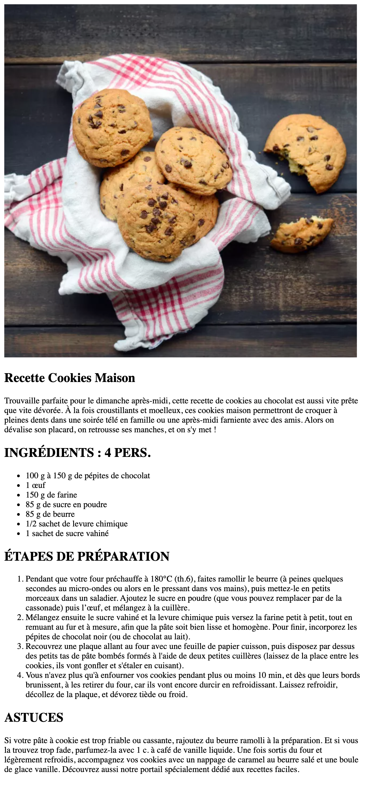

# Exercice - La recette

Réalisons une nouvelle page un peu plus complète que la précédente. Pas besoin de nouvelle théorie, il faut juste appliquer ce que on a vus jusqu'à maintenant.

## :memo: Objectifs

- Réaliser une page HTML en utilisant les balises vues dans la théorie et avec du contenu réel
- Suivre des consignes précises
- Apprendre les bases d'HTML
- Apprendre à se débrouiller en allant lire la théorie vue ou la documentation

## :white_check_mark: Evaluations

- Respect des consignes
  - La page présente tous les éléments demandés
- La syntaxe est correcte
- L'indentation est correcte

## Consignes

- Ouvre VSCode
- Réalise une page en HTML que tu nommeras `ma-recette.html`. Sauvegarde-la dans le dossier `Mes exercices HTML` déjà créé dans le dossier `Mes Documents` de ton ordinateur.
- Parles d'une recette de cuisine qui te plaît et mets-là en page en utilisant la structure HTML de base et quelques balises vues dans la théorie.
- Change le titre de la page dans la balise `<head>` pour qu'il indique bien qu'il s'agit de ta recette.
- Utilise les balises `section` pour séparer ton contenu (résumé, ingrédients, étapes de préparation,...)
- Utilise des balises `p`pour écrire quelques lignes sur pourquoi tu aimes cette recette.
- Utilise une balise `img` pour placer une image de ta recette
- Utilise une liste ordonnées pour les étapes de préparations et une liste non-ordonnées pour la liste des ingrédients.
- Mets en valeur les éléments importants de ta recette avec les balises `strong`et `em`. Ou prépare le terrain pour un future exercice en plaçant des `span` avec une `class` qui a du sens.
- Ne te pré-occupe pas pour l'instant de la forme, on ne fait que mettre nos éléments à place, on embellira tout ça plus tard.
- (bonus) insère un tableau avec des infos dedans.

## Astuces / Allez plus loin

- Retourne lire la théorie vue plus tôt
- Pourquoi ne pas essayer d'insérer une Google Font?

## Courage

Cet exercice peut te sembler difficile mais ne t'en faites pas, le but ici c'est d'essayer d'allez le plus loin possible et d'apprendre à chercher un peu par soi même. Nous approfondirons tes connaissances avec la suite de la matière et lors d'autres exercices ;)

Si tu bloque, n'hésite pas à demander de l'aide à tes collègues ou à ton formateur.

## Exemple

[:rewind: Retour au sommaire du cours](./README.md#table-des-matières)
