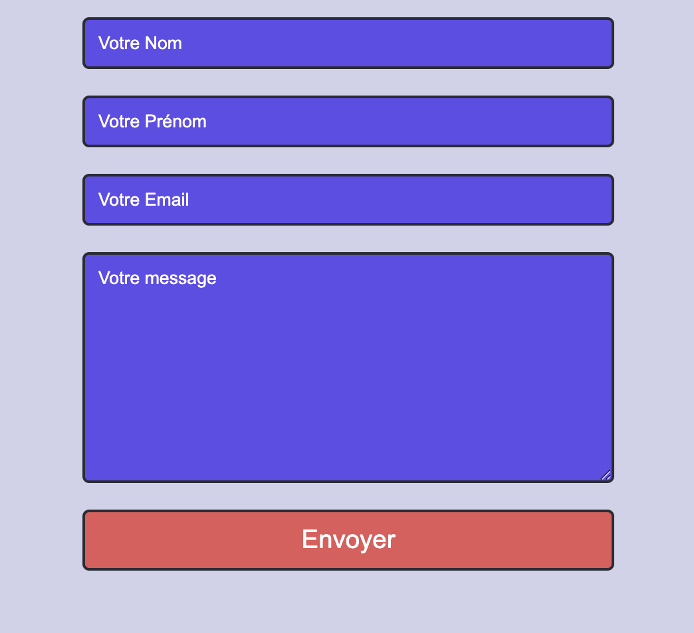

<!-- omit in toc -->
# Exercice Formulaires

Nous allons juste préparer quelques formulaires ensembles, pas de fonctionnalité, juste du style.

## Exercice 1 - Mise en place du formulaire

Créons ensemble notre premier formulaire de contact.

1. Crée un nouveau document `formulaire.html` et lie-lui une page de style `formulaire.css`.
2. Ajoute le squelette HTML habituel.
3. Dans le `<body>`, ajoute une balise `<div>` avec la classe `form`. Ensuite insère dans notre `<div>` une balise `<form>`
4. Ajoute ensuite deux `<input>` de type `text` dans la balise `<form>`.
5. Pour chacun des inputs ajoute un attribut `name` et `placeholder` pour récupérer le **Nom** et **Prénom**.
6. Ajoute un nouvel `<input>` de type `email` et donne lui également les attributs `name` et `placeholder`
7. Ajoute un `<textarea>` avec comme `name` **message** et pareil pour le `placeholder`
8. Ajoute un `input` de type `submit` avec comme `value` **Envoyer**

## Exercice 2 - Un formulaire qui a du style

Donnons un peu du style à ce pauvre formulaire. Tu peux retrouver quelques explications [sur W3School](https://www.w3schools.com/css/css_form.asp).

Soit tu te lances en solo dans cette aventure en cherchant des exemples sur le net et en lisant la documentation. Soit tu peux suivre le pas à pas que je te propose ici en dessous

Je vais ici vous guider pour styliser votre formulaire, on va utiliser pleins de techniques différentes dont certaines choses qu'on a pas encore vu comme Flexbox! Pas de panique, je t'explique tout ça. N'hésite pas à regarder l'avancé du style à chaque étape. Ou même à changer le style quand tu seras à l'aise avec.

### 1. Dans notre feuille de style, commençons par styliser un peu notre `<body>`

```css 
body{
  background-color: #d1d1e9;
  display: flex;
  justify-content: center;
}
```

> :bulb: Ici nous utilisons la propriété `display:flex` et `justify-content:center` pour centrer horizontalement tout le contenu de notre page. Ne te tracasse pas, on verra plus en détail comment on utilise Flex dans le prochain cours!

### 2. Ensuite on va cibler notre `<div>`

```css
.form{
  width: 400px;
}
```

> :bulb: Rien de nouveau ici, juste une valeur en pixel de la largeur de notre div qui contient le formulaire.

### 3. On va maintenant styliser nos `<input>` et `<textarea>`

```css
input, textarea{
  padding: 10px;
  margin: 10px 0;
  background-color:#6246ea;
  border-radius: 5px;
  border: #2b2c34 2px solid;
  color: #fffffe;
  font-family: Arial, Helvetica, sans-serif;
}
```

> :bulb: De nouveau rien de bien nouveau, on définit le style de nos éléments avec des propriétés classique. Comme ce sont les même pour les deux éléments, on peut les séparer d'une virgule pour ne pas devoir répéter notre style.

### 4. Notre bouton à la même style que nos champs de texte, ce n'est pas super top, changeons ça!

```css
input[type="submit"]{
  background-color: #e45858;
  font-size: larger;
}
```

> :bulb: Petite nouveauté, on cible ici nos éléments `<input>` mais seulement ceux dont l'attribut est `type` et sa valeur `submit`

### 5. Lorsque l'on est avec notre curseur dans un champs, celui-ci est entouré bizarrement, ce n'est pas trop dans le style qu'on veut, voyons ce que l'ont peut faire.

```css
input:focus, textarea:focus{
  outline: none;
  border: #e45858 2px solid;
}
```

> :bulb: L'effet indésirable ici c'était le fameux `focus` qui est l'état d'un élément actif. On définit donc le style de ce fameux `focus`pour nos deux type de champs de formulaire.


### 6. La couleur aussi du texte de `placeholder` est franchement pas terrible. 

```css
::placeholder{
  color: #fffffe;
}
```

> :bulb: Ici on utilise un pseudo-element et le sélecteur `*` (qui si il n'est pas indiqué est pris par défaut de toute façon) pour sélectionner tous les `placeholder`.

### 7. Et pour finir on va mettre nos éléments de formulaire l'un en dessous de l'autre

```css
form{
  display: flex;
  flex-direction: column;
  flex-grow: 0;
}
```

> :bulb: Tiens donc, revoici notre cher ami `Flex`. Ici on l'utilise pour indiquer que nos éléments doivent être en colone. De nouveau on verra plus cela en détail dans le cours sur Flexbox!

## Voilà



C'est déjà terminé pour les formulaires, tu as vu que c'était un vrai jeu d'enfant que de sélectionner nos éléments et de les styliser, non? :) 

[:rewind: Retour au sommaire du cours](./README.md#table-des-matières)
