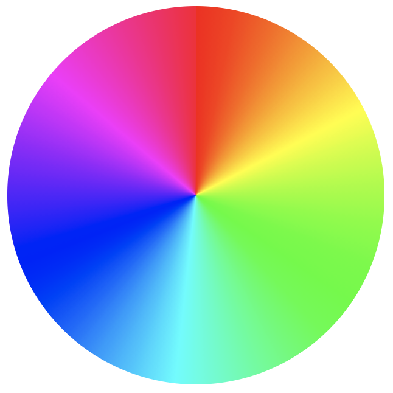
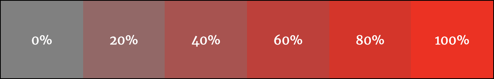
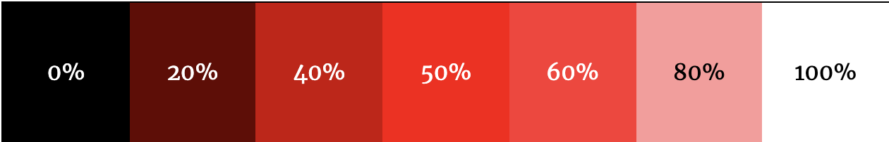

<!-- omit in toc -->
# CSS Advanced

Voyons ensemble encore quelques techniques supplémentaires qui nous seront utiles en CSS.

<!-- omit in toc -->
## Table des matières

- [Variables ou custom properties](#variables-ou-custom-properties)
- [Import](#import)
  - [Une feuille de style ou plusieurs?](#une-feuille-de-style-ou-plusieurs)
- [RGB, Hexadecimal ou HSL?](#rgb-hexadecimal-ou-hsl)
  - [La problématique](#la-problématique)
  - [La solution](#la-solution)
    - [Hue](#hue)
    - [Saturation](#saturation)
    - [Lightness](#lightness)
  - [Conclusion](#conclusion)

## Variables ou custom properties

Depuis CSS3 il est possible de créer des variables. Il s'agit d'informations que pouvez réutilisez dans toutes votre feuille de style. Vous pouvez stocker des couleurs, des polices ou n'importe quelle autre propriété CSS.

Un des avantages des variables est la lisibilité. En effet il sera plus facile de lire `primary-color`que le code hexadécimal de cette couleur `#FF4000`.

Un autre avantage, évident, c'est la facilité d'éffectuer des modifications sur l'ensemble de sa feuille de style. Il ne faut en effet modifier qu'une fois la valeur de sa variable et le changement se ferra partout où vous avez indiqué cette variable.

<!-- omit in toc -->
### Utilisation simple

On déclare une variable dans `::root` en indiquant deux tirets devant son nom. Ensuite il faut utiliser la valeur `var(nom-de-variable)`.

```css
:root {
  --main-bg-color: red;
}
element {
  background-color: var(--main-bg-color);
}
```

[:book:En savoir plus](https://developer.mozilla.org/fr/docs/Web/CSS/Using_CSS_custom_properties)

[:arrow_up: Revenir au top](#table-des-matières)

## Import

Vous commencez sans doute à avoir une feuille de style à rallonge et vous ne vous y retrouvez plus? Et bien la solution réside dans les `import`. En effet la règle `@import`permet d'inclure une feuille de style dans une autre. Ainsi vous pouvez diviser votre travail en plusieurs feuilles en fonction des différentes sections que vous devez styliser.

Il est également possible d'utiliser les mediaqueries pour utiliser une feuille de style particulière si la règle est respectée.

**Exemple**: main.css, header.css, footer.css, nav.css, card.css, print.css...

<!-- omit in toc -->
### Utilisation

Il suffit de placer **au dessus de toute autre règle/sélecteur** votre `@import`, lui indiquer la feuille qu'il doit importer et préciser éventuellement les règles qu'il doit respecter pour utiliser cette feuille de style.

```css
@import "header.css";
@import url("nav.css");
@import "printstyle.css" print; /* use it only on print */
@import "mobile.css" screen and {max-width: 768px}; /* use it only if media is screen and viewport is max 768px */
```

Tout le code contenu dans votre feuille importé sera ajouté. 

### Une feuille de style ou plusieurs?

Il est donc intéressant de créer une feuille de style principale `style.css` et de la lier à toutes vos pages. Ensuite dedans vous importer toutes vos pages de "composant". Ainsi vous ne devez pas vous occuper d'une page à rallonge pleines de lignes de CSS, mais vous divisez votre travail dans plusieurs pages.

```css
/* style.css */

@import "header.css";
@import "nav.css";
@import "content.css";

/* Des propriétés liées à toutes vos pages (comme les polices d'écriture, les couleurs,...) */

```

[:arrow_up: Revenir au top](#table-des-matières)

## RGB, Hexadecimal ou HSL?

Jusqu'à maintenant on a principalement utilisé des codes hexadécimaux pour définir nos couleurs dans nos feuilles de styles. Mais cela n'est pas très pratique... Voyons une solution: l'utilisation des couleurs HSL.

### La problématique

Le soucis avec les couleurs définie en **RGB** ou **hexadecimal** c'est qu'on a pas une idée claire de ce que représente le code en couleur. Alors oui on peut s'aider du **color picker** de VSCode, mais nous pourrions aussi déterminer nos couleurs différemment.

```css
.rgb{color: rgb(255,0,0)}
.hex{color: #FF0000}
```

### La solution

Utiliser les couleurs en **HSL**.

- H pour "hue" ou teinte
- S pour "saturation"
- L pour "lightness" ou luminosité

```css
.hsl{color: hsl(0, 100%, 50%);}
```

La première valeur prend un chiffre de 0 à 360 et les deux autres prennent un %. Voyons comment retrouver nos couleurs.

#### Hue

La teinte est en faite la couleur que vous souhaitez. Prenez la roue de couleur ci-dessous. On démarre à 0 en haut et donc dans les tons de rouge. Ensuite on tourne dans le sens des aiguilles d'une montre. Par exemple si on prend la valeur 90 on se retrouve dans les verts. À 180 on est dans du cyan, à 270 on est dans les bleus-mauve et si on revient à 360 on retourne en rouge. Une fois que l'on a compris cela, c'est déjà plus simple.



#### Saturation

La saturation c'est à quel point la couleur est grise. Si la valeur approche de 0% on est dans les gris et si on approche des 100% on a la couleur pure.



#### Lightness

La luminosité détermine si la couleur est plus proche du noir (0%) ou du blanc (100%)



### Conclusion

Il est donc très facile d'apporter des modifications à une couleur, il suffit de trouver la bonne teinte, ensuite si elle ne convient pas totalement on peut facilement changer sa saturation ou luminosité. 

C'est aussi plus simple à gérer en cas de changement de couleur. Exemple:

```css
.button{background-color: hsl(0, 100%, 50%)}
.button:hover{background-color: hsl(0, 100%, 30%)}

.button-hex{background-color: #ff0000}
.button-hex:hover{background-color: #990000}

.button-rgb{background-color: rgb(255, 0, 0)}
.button-rgb:hover{background-color: rgb(153, 0, 0)}
```

> Dans cet exemple, on change que la luminosité, mais lorsqu'on li la couleur en HSL ça à du sens, tandis que l'exemple en hexadecimal ou rgb est plus confus.

Et pour allez encore plus loins on pourrait utiliser les variables CSS.

```css
:root{--primary: 0}
.button{background-color: hsl(var(--primary), 100%, 50%)}
.button:hover{background-color: hsl(var(--primary), 100%, 30%)}
```

> Dans cet exemple, on utilise une variable, du coup si on décide de changer notre couleur principale, il suffit de changer la variable et on garde le même effet de hover sur notre bouton.

> :bulb: Voici [un site web](https://itpastorn.github.io/webbteknik/future-stuff/svg/color-wheel.html) pour retrouver une couleur sur la roue chromatique

[:arrow_up: Revenir au top](#table-des-matières)

[:rewind: Retour au sommaire du cours](./README.md#table-des-matières)
