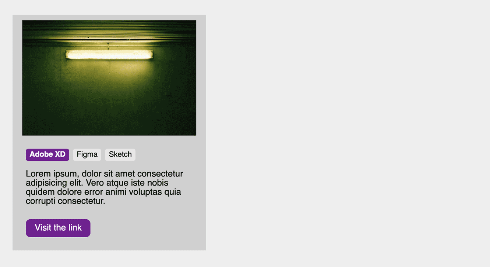

<!-- omit in toc -->
# Méthodologie de nommage

Il existe bon nombres de méthodologie de nommage pour les classes et id, elles existent pour simplifier la tâche des développeurs. Cela rend plus facile la collaboration dans une équipe, car tout le monde s'applique à respecter la méthode choisie et ainsi tout est plus claire pour l'ensemble des personnes travaillant sur le code.

<!-- omit in toc -->
# Table des matières

- [BEM (Block Element Modifier) : B__E — M](#bem-block-element-modifier--b__e--m)
  - [Comment qu'on écrit avec BEM](#comment-quon-écrit-avec-bem)
  - [Convention de nommage BEM](#convention-de-nommage-bem)
  - [Avantages et Inconvénients](#avantages-et-inconvénients)
- [Conclusion](#conclusion)
- [Crédits](#crédits)

## BEM (Block Element Modifier) : B__E — M

Bem ou Block Element Modifier est une méthodologie de nommage qui vise à créer des composants réutilisables pour vos classes HTML et vos sélecteurs CSS. L'intérêt réside dans la possibilité de sélectionner un élément bien précis sans devoir toujours utiliser la descendance (ex: sélectionner les enfants du parents), car sur certains projets plus volumineux vous risquez de sélectionner des parties d'une autre page que vous auriez oublié et du coup casser le projet.

L'autre point fort, c'est que quand vous aurez adopter cette méthodologie, vous écrirez vos classes beaucoup plus rapidement et efficacement et aurez l'habitude de les préparer pour leurs utilisations globale plutôt que par cas. Je m'explique.

- Vous voulez créer un bouton sur votre page. Vous allez créer une classe `button`
- Sur une deuxième page vous avez encore un bouton mais ce dernier doit être mis en valeur, vous allez créer une classe `active`.
- Plus tard vous voulez mettre une div en évidence aussi de la même façon que votre bouton. Mais la classe `active`est déjà prise. Du coup vous allez peut-être la nommer `active2` ou `active-div`. Alors oui, jusque là on s'y retrouve mais sur un gros projet ça peut vite devenir la galère. Surtout si vous êtes plusieurs développeurs CSS avec chacun une logique différente de nommage.

Voilà où BEM peut intervenir.

Il va falloir penser vos éléments autrement, voici un exemple:



### Comment qu'on écrit avec BEM

Et bien c'est simple, considérez l'exemple du dessus. On a notre encart qui contient une image et différents liens et textes. Ca s'appel une carte, ça sera notre block, l'élément principal de notre composant, celui qui va contenir tout le reste.

1. On va commencer par créer notre **B**lock avec une `class="card"`.
2. Ensuite ce block est composé d'**É**léments divers et variés. Chacun d'eux va recevoir une classe qui permet de rapidement identifier l'origine de cet élément: `class="card__img"`, `class="card__content"`, `class="card__list"`, `class="card__item"`,...
3. Notre `card__item`a besoin d'une classe pour être mis en évidence. C'est donc une classe qui va **M**odifier un élément. On va donc noter `class="card__item--active"`

**Que faut-il retenir?**

- Un block: juste son nom

```css
.card{
  background-color: red;
}
```

- Un élément: le nom de son block + double underscore + nom de l'élément

```css
.card__img{
  width: 50%;
}
```

- Un modifier: le nom d'élément + double tiret + nom du modifier

```css
.card__img--important{
  border: red solid 1px;
}
```

### Convention de nommage BEM

Voyons maintenant quelques petites règles supplémentaires pour l'écriture de vos classes.

- Block: on sépare les différents noms de notre classe par un tiret (on appel ça le `kebab-case`). Exemple: `block-name`
- Element: pareil que pour les blocks, on utilise le `kebab-case`. Exemple: `block-name__element-name`
- Modifier: toujours pareil. Exemple: `block-name--modifier-name` ou `block-name__element-name--modifier-name`

### Avantages et Inconvénients

Cette méthode permet d'avoir des classes clair et précise et de s'y retrouver facilement. Par contre dès que l'on veut utiliser des `modifier`on se retrouve avec des noms à rallonge pas très gracieux.

## Conclusion

Il existe d'autre méthode de nommage comme ABEM, [OOCSS](http://oocss.org/) (Object-Oriented CSS), [SUIT CSS](https://suitcss.github.io/), ou encore [SMACSS](https://smacss.com/) (Scalable and Modular Architecture for CSS), entre autres… Il n'est pas nécessaire d'en employer une constamment, mais dès lors que vous travailler sur un projet un peu plus conséquent et lorsqu'on aura vu les pré-processeur CSS (comme SASS) ces méthodes deviendront un véritable atout. Il est aussi possible que lorsque vous travaillerez dans une boîte ils utilisent l'une ou l'autre méthode.
Ici il s'agissait de vous introduire au concept. A vous de vous renseigner sur les autres méthodes si vous le souhaitez et à choisir votre préféré.

## Crédits

Théorie réalisé sur base de l'article suivant: [Les méthodologies BEM & ABEM en CSS](https://medium.com/slickteam/les-m%C3%A9thodologies-bem-abem-en-css-58f821c5194e)

[:arrow_up: Revenir au top](#table-des-matières)

[:rewind: Retour au sommaire du cours](./README.md#table-des-matières)
