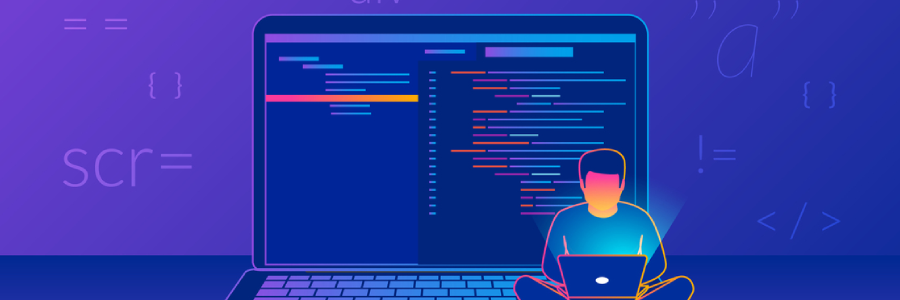

# Initiation à l'Intégration

## Présentation

> Cours rédigé pour l'année 2022
>
> Auteur: Jeremy Scala

Bienvenue chez Sirius dans le cours d'Initiation à l'HTML et au CSS. Lors de ce cours tu vas apprendre les bases pour créer tes propres pages web en les codant toi-même et en partant d'une page blanche. Génial, non?

## Au programme

Ce cours se découpe en :two: séquences sur une période de :four::five: jours.

1. [HTML / CSS - niveau débutant :cat:](1-html-css-debutant/README.md) (:two::five: jours)
2. [HTML / CSS - niveau avancé :fire:](2-html-css-avance/README.md) (:two::zero: jours)

## Déroulement de l'initiation

Nous commencerons par un peu de théorie à connaître en web.

Ensuite nous aborderons les bases de l'HTML pour apprendre à structurer tes premières pages avec du contenu.

Viens ensuite le CSS qui permettra à une page blanche de prendre vie et d'avoir du style.

Ces deux langages web seront vus d'abord sous forme d'un module **débutant**:cat: autrement dit, les bases qu'il faut connaître avant d'allez plus loin. Ensuite un module **avancé**:fire: te permettra d'en apprendre plus et d'utiliser des outils plus complexes afin de réaliser des pages web encore plus stylé!

Ça te plait? Tant mieux. Ça te fait peur? Ne t'en fais pas tu vas vite progresser et je suis là pour t'aider à y parvenir!

## Charte

Voici quelques points de règles à respecter pour que ta formation se passe le mieux possible!

### Horaire

Tu devras être présent **du lundi au vendredi** de **9h à 16h**.

:exclamation: Exception le **jeudi**, tu peux partir dès **15h**.

Toute absence devra être **justifiée**. Si tu es absent, envoie un email à ton formateur pour le prévenir: jeremy.scala@possibles.org.

En effet, tu seras rémunéré 1€brut de l'heure, donc c'est avantageux pour toi d'être le plus présent possible ou du moins de fournir un justificatif quant à tes absences.

### Les pauses

Il y a une pause à **10h30** et **14h30**, de **15 minutes** chacune.

Le temps de midi commence à **12h et dure une heure**.

### Les commodités du PIL

:warning: Le badge qui t'as été remis est nominatif! Si tu le perds tu devras **payer 15€** pour un nouveau! Donc garde-le précieusement sur toi! C'est lui aussi qui te permet de rentrer dans les bâtiments et de pouvoir profiter des installations.

Tu peux rentrer dans le bâtiment principal où il y a la cafétéria à partir de 8h. Et tu pourras accéder aux locaux de cours à partir de 8h45.

Tu es autorisé à accéder aux appareils mis à ta disposition dans la réfectoire (four à micro-onde, café, évier,...).

### Soit poli et courtois, sinon le ban sera pour toi

- Respecte tes condisciples et tous les membres de Sirius/Monde des Possibles.
- Si tu as un problème, quel qu'il soit, n'hésite pas à venir en parler à un membre de l'équipe Sirius.
- **Mets ton téléphone en silencieux!**

## Veilles technologiques

Dans le but d'être toujours actif dans ton apprentissage, il est plus que conseillé de t'organiser une petite veille technologique. C'est à dire, de toi même continuer à te renseigner sur les sujets qui te passionne dans le code ou le graphisme.

Va lire des articles de code, même si tu comprends pas la moitié c'est toujours utile car ça éveille ta curiosité et de toute façon tu retiendras forcément quelque chose qui pourrait s'avérer utile un jour.

N'hésite pas à jeter un oeil sur des collections d'images pour t'inspirer. Il y a pleins de sites qui référencent les créations de milliers d'artistes. Même si ce n'est pas encore de ton niveau, ça vaut toujours la peine de regarder, de s'inspirer. Ce n'est pas parce que tu ne sais pas peindre comme Picaso que tu ne peux pas être inspiré par ses créations.

### Quelques liens utiles pour ta veille techno

Graphisme:

- [DeviantArt](http://www.deviantart.com) : est l'endroit où l'art et la communauté prospèrent. Explorez plus de 350 millions d'œuvres d'art tout en se connectant à d'autres artistes et amateurs d'art.
- [Behance](https://www.behance.net/) : is the world's largest creative network for showcasing and discovering creative work.

Programmation:

- [Codepen](https://codepen.io/trending) : Codepen est un environnement de développement social pour les concepteurs et les développeurs front-end.
- [Medium](https://medium.com/) : Medium est une plate-forme ouverte où les lecteurs trouvent une pensée dynamique et où des voix expertes et non découvertes peuvent partager leur écriture sur n'importe quel sujet.
- [Dev](https://dev.to/) : est un endroit où les codeurs partagent, restent à jour et développent leur carrière.

Extensions navigateur:

- [Panda](https://usepanda.com/) : Une extension chrome pour garder un oeil sur des articles intéressants de plusieurs sites.
- [30 Seconds Knowledge](https://30secondsofknowledge.com/) : Une extension chrome qui ouvre une page avec une info que tu peux lire en 30 secondes sur un sujet lié au code.

## Communication :speaking_head:	

### Discord

Cette année on va utiliser Discord pour communiquer. C'est gratuit et simple.

- [Clique ici pour t'inscrire](https://discord.com/register)
- [Clique ici pour rejoindre le serveur de l'école](https://discord.gg/qdwMKyKB9D)

### Boîte à idées

Si tu as des idées ou des plaintes et que tu souhaites les formuler de manière anonymes, tu peux utiliser la boîte à idée mise en place en suivant le lien ci-dessous.

[Par ici les idées :bulb:](https://forms.gle/eNeLhiuPkveV6cDh7)

## Activité brise glace

Et maintenant place au fun!

### Présentations en slides

Commençons par réaliser une petite présentation avec [Google Slides](https://www.google.com/slides/about/) puis viens te présenter à tes nouveaux collègues de formation.

- **Parle de toi**. Dit nous qui tu es, ce que tu aimes et n'aime pas faire dans la vie, parles nous de tes passions, ce que tu veux faire plus tard. Bref, on veut **TOUT** savoir sur toi!
- Ajoute quelques photos de toi si tu en as ou va chercher des illustrations ou gif rigolo (tu peux trouver cela sur [Unsplash](http://unsplash.com) ou sur [Giphy](http://giphy.com))

### Charte de classe

Prenons quelques minutes pour écrire sur une feuilles quelques mots-clés par rapport à ce que tu considères comme important au bon déroulement des cours en classe. Par exemple, tu peux dire que tu as besoin de calme ou bien de pouvoir écouter de la musique ou encore d'avoir du café.
