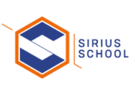

# Sirius School 2022 - Initiation à la programmation

## Introduction

Bonjour et bienvenue à toutes et tous,

Félicitations vous avez réussi votre test, vous faites maintenant partie de l'équipe Sirius ! 
Lisez-bien l'entiereté de ce document vous retrouverez toutes les informations nécessaires à votre apprentissage.

## Au programme

### [Module 1 - Introduction au Web](/1_Web_Intro/story_web.md)

### [Module 2 - Introduction HTML & CSS](/2_HTML_CSS_Intro/)

### [Module 3 - Introduction JavaScript](/3_JS_Intro/)

### [Module 4 - JavaScript niveau avancé](/4_JS_Advanced/)

### [Module 5 - Projet Global en collaboration avec les autres formations Sirius.](/5_Global_Project/)

## [Exercices](./ExercisesJS/)

## [Ressources](./Resources/)

- [Feuilles de triche](/Resources/cheat_sheets.md)
- [Images](/Resources/Images/)
- [Documentations](/Resources/Docs/)

## Déroulement de l'inititation

Nous commencerons par aborder le développement web avec l'HTML et le CSS. Nous verrons comment d'une page blanche on peut donner vie à une page web. 

Nous entrerons ensuite dans le vif du sujet de la formation **JavaScript**. On va évidemment commencer par les bases du langage avec des principes essentiels pour le bon déroulement de ton apprentissage. Tu réaliseras des exercices sous forme de projets seul ou en groupe en fonction de ce dernier. 

Et maintenant plus de pitié, *JavaScript*, **JavaScript**, ***Javascript***. Et oui on aura du **JS** pour déjeuner, pour dîner et pour souper ! Trève de plaisanterie nous verrons la puissance du langage avec une multitude de fonctionnalités géniales, la connection aux API (Application Programming Interfaces), OOP (Object Oriented Programming) et bien d'autres ! 

En collaboration avec les deux autres formations, nous réaliserons tous ensemble un projet global qui aura pour but de vous familiariser avec le travail en équipe que vous rencontrerez en entreprise plus tard. 

Ça te plait? Tant mieux. Ça te fait peur? Pas de panique, tu vas vite progresser et on étudiera tout ça ensemble !

[:arrow_up: Revenir au début](#sirius-school-2022---initiation-à-la-programmation)

## Charte

 
Voici quelques points de règles à respecter pour que ta formation se passe le mieux possible !

### Horaire ⏰

Tu devras être présent du lundi au vendredi de **9h00** à **16h00**.
Sauf le jeudi qui sera entre **9h00** et **15h00**.

Toute absence devra être justifiée. Si tu es absent, envoie un email à ton formateur pour le prévenir le plus tôt possible : lucas.ielli@possibles.org en copie le coordinateur : kevincocco@possibles.org et l'éducatrice : laetitiagrosemans@possibles.org

### Les pauses

Il y a une pause à **10h30** et **14h30**, de **15 minutes** chacune. 
Tu auras une heure de temps de midi de **12h00** à **13h00** ce qui te laissera largement le temps d'aller chercher quelque chose si commme moi tu ne prends pas le temps de faire des tartines 😋 
Préviens ton formateur pour tout motif d'absence, si tu reçois un appel important, si tu souhaites prendre l'air ou tout simplement si tu dois te rendre aux toilettes.

### Soit poli et courtois, sinon le ban sera pour toi. 
- Respecte tes condisciples ainsi que tous les membres de Sirius et du Monde des Possibles 🤝🤲
- Si tu as un problème, quel qu'il soit, n'hésites pas à venir en parler à un membre de Sirius.
- **Mets ton téléphone en silencieux !** 📴📵
- Évite les débats sans fin comme la politique, la religion et autres. Chacun à ses croyances et vous devez les respecter.
- Sois ponctuel, comme ça tu ne rateras pas une miette du cours et tu ne feras pas attendre tes condisciples ⌚

[:arrow_up: Revenir au début](#sirius-school-2022---initiation-à-la-programmation)

## Veilles technologiques

 

Dans le but d'être toujours actif dans ton apprentissage, il est plus que conseillé de t'organiser une petite veille technologique. C'est à dire, de toi même continuer à te renseigner sur les sujets qui te passionne dans le code ou l'IT en général.

Va lire des articles de code, même si tu comprends pas la moitié c'est toujours utile car ça éveille ta curiosité et de toute façon tu retiendras forcément quelque chose qui pourrait s'avérer utile un jour. Et si tu souhaites partager ta découverte et ce que tu as appris, vient en parler à ton formateur et nous organiserons une présentation devant la classe.

N'hésite pas à jeter un oeil aux autres librairies ou frameworks JavaScript ou même aux autres langages. Il existe beaucoup de langages différents qui te permettent de faire d'autre choses. Prends le temps de regarder les sites webs qui référencent les créations de milliers de développeurs. Même si ce n'est pas encore de ton niveau, ça vaut toujours la peine de regarder, de t'inspirer. Ce n'est pas parce que tu ne sais pas peindre comme Picasso que tu ne peux pas être inspiré par ses créations.

Tu trouveras quelques liens utiles dans le dossier [ressources](./Resources/).

### Présentation d'une veille

Comme dit plus haut, il va falloir présenter des sujets de veilles à tout le monde. Ce petit exercice à pour but de t'apprendre à réaliser une bonne veille, une bonne présentation et à prendre la parole devant tes camarades. Cela fait partie des soft-skills que tu vas développer tout au long de la formation. 
En effet dans une entreprise il est fort à parier qu'on te demandera d'expliquer de façon simple ce que tu as réaliser ou ce que tu vas réaliser pour un projet client, il est donc important de savoir expliquer aussi bien à tes collègues qu'au client lui-même.

Pour la première, c'est moi qui vais vous la donner pour que vous compreniez ce qu'il faut faire, mais par après, ça sera à toi de t'y coller. Nous déciderons plus tard à quelle fréquence nous ferons ces présentations.

## Activité brise-glace

**Place au fun !**

### Présentation
Commençons par une petite présentation, je vais donner à chacun un post-it sur lequel vous allez écrire en toute discrétion et sans montrer aux autres apprenants, **2 vérités et un mensonge** sur vous. Ensuite chacun votre tour vous vous lèverez et direz à haute voix votre prénom et vos 3 phrases. Les autres devront deviner laquelle de ces 3 phrases est un mensonge 😜

### Les points communs

Deuxième petit jeu pour en apprendre un peu plus sur chacun : rendez-vous sur [Miro](https://miro.com/welcomeonboard/SlRERmdmTTh3bnFpWFZCU1JtWkQxbUpNajFhcVoyaWlzOU9EYmVUc0R1TzhYNGFGMmx6U0laU1QwVUhMQldGYXwzMDc0NDU3MzY2MzQ0MDYxMjQz?share_link_id=736038607182) ce magnifique tableau blanc en ligne va te servir à écrire :
  - Ton nom et prénom en titre.
  - Quelques-unes de tes passions. Si tu n'as pas assez de place réduit la taille de la police 😉
  - Et une photo de toi ou de quelque chose que tu aimes.

Pour la suite, je demanderai à tout le monde de lire le "post-it Miro" des autres et si vous avez des points communs de les relier 😀

### Charte de classe

Si on a le temps aujourd'hui pour ce premier jour de formation, nous pourrions prendre quelques minutes pour écrire 3 mots-clés que tu considères important au bon déroulement des cours. Par exemple, tu peux dire que tu as besoin de calme ou bien de pouvoir écouter de la musique 🎵 ou encore de café ou de thé 🍵

[:arrow_up: Revenir au début](#sirius-school-2022---initiation-à-la-programmation)

> Original : [Jeremy Scala](https://github.com/scalajeremy)
>
> Modification : [Lucas Ielli](https://github.com/LucasIelli)
