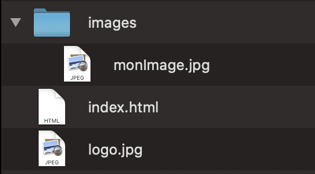

<!-- omit in toc -->
# Quelques balises pour mettre en forme

Maintenant qu'on en sait un peu plus sur comment est structuré une page web basique, voyons un peu comment mettre tous ça en page.

Il existe une multitude de balises à utiliser pour rédiger un document HTML, nous verrons les plus utiles. Surtout n'hésite pas à consulter la documentation officielle pour en savoir plus et en découvrir d'autre.

> :bulb: Ouvrez VS code et expérimentez les balises qu'on va voir à partir d'ici. Pas besoin de grand chose, juste un fichier .html avec ces balises suffiront ou tu peux reprendre le squelette créer précédemment.

<!-- omit in toc -->
## Table des matières

- [Un peu de sémantique](#un-peu-de-sémantique)
  - [SEO](#seo)
  - [Accessibilité](#accessibilité)
- [Classe et ID](#classe-et-id)
- [La balise `<div>`](#la-balise-div)
- [La balise `<p>`](#la-balise-p)
- [Les balises `<h1>`, `<h2>`, `<h3>`, `<h4>`, `<h5>`, `<h6>`](#les-balises-h1-h2-h3-h4-h5-h6)
- [La balise `<blockquote>`](#la-balise-blockquote)
- [La balise `<details>`](#la-balise-details)
- [La balise `<strong>`](#la-balise-strong)
- [La balise `<em>`](#la-balise-em)
- [La balise `<span>`](#la-balise-span)
- [La balise ``](#la-balise-img)
- [La balise `<a>`](#la-balise-a)
  - [Les ancres](#les-ancres)
- [Les liens interne et externe](#les-liens-interne-et-externe)
- [Les tableaux](#les-tableaux)
  - [La balise `<table>`](#la-balise-table)
  - [Les balises `<tr>`, `<td>`, `<th>`](#les-balises-tr-td-th)
- [Les listes](#les-listes)
  - [Les listes non ordonnées `<ul>`](#les-listes-non-ordonnées-ul)
  - [Les listes ordonnées `<ol>`](#les-listes-ordonnées-ol)
  - [La balise `<li>`](#la-balise-li)
- [Encore quelques balises](#encore-quelques-balises)
- [Pour allez plus loin](#pour-allez-plus-loin)

## Un peu de sémantique

Un élément sémantique est un élément avec une signification. Une phrase en titre n'a pas la même signification qu'en pied de page.

C'est pour cela que pour bien composer un document html, il faut d'abord raisonner en termes de définition de chacun des composants plutôt qu'en termes d'apparence graphique. Pour ce faire on va se demander l'utilité de chaque bout de code: "Est-ce que ce texte est: un titre? Un paragraphe? Une légende? Et ce bloc, est-ce une section? Une note de l'auteur?" et en fonction de la réponse on va utiliser la balise qui correspond le mieux à notre élément.

Exemple d'une balise non-sémantique: `<div>`, `<span>`

Exemple d'une balise sémantique: `<article>`, `<section>`

Le but de ces balises est de donner au navigateur et au développeur une description du contenu qui suit. Par exemple il existe une balise `<header>`, ce qui permet d'indiquer à votre navigateur que tout le contenu qui s'y trouvera ferra partie du haut de votre page. C'est une alternative et une bonne pratique par rapport à `<div class="header">`

Voici la liste de ces balises:

- `<article>`
- `<aside>`
- `<details>`
- `<figcaption>`
- `<figure>`
- `<footer>`
- `<header>`
- `<main>`
- `<mark>`
- `<nav>`
- `<section>`


> :book: [plus d'infos](https://www.w3schools.com/html/html5_semantic_elements.asp)

[:arrow_up: Revenir au top](#table-des-matières)

### SEO

L'objectif d'un moteur de recherche est de fournir les meilleurs résultats à l'utilisateur. Pour ce faire les moteurs de recherches utilisent des bots qui scanne toutes les pages web et essaye de "comprendre" ce dont parle la page grâce à la structure html (titre, sous-titre, liste,...).

[:arrow_up: Revenir au top](#table-des-matières)

### Accessibilité

On veut que votre page soit accessible au plus de personne possible, y compris les aveugles et mal-voyant. Pour faciliter la lecture de ces sites par les liseuses d'écran, il faut utiliser au mieux les balises sémantiques.

> :bulb: Essayez par vous même avec [ces liseuses d'écran](https://stackoverflow.com/a/43368748/53960)

[:arrow_up: Revenir au top](#table-des-matières)

## Classe et ID

Pour identifier nos différentes balises et les différentier, on peut leurs attribuer des `classes`et des `id`. 

- **classe**: peut être multiple sur la page.
- **id**: doit être unique sur la page.

## La balise `<div>`

La **div**ision est un conteneur. Cette balise permet de structurer sa page en "bloc". Dans ces balises/bloc on insérera le contenu adéquat (image, texte, liens,....).

```html
<div class="container">
  <p>contenu</p>
</div>
```

[:arrow_up: Revenir au top](#table-des-matières)

## La balise `<p>`

P pour paragraphe, c'est la balise la plus courante pour rédiger du texte. C'est un bloc qui est suivis d'un saut à la ligne. On peut mettre la balise `<p>` dans un `<div>` mais jamais de `<p>` dans un autre.

```html
<p>Je suis un paragraphe</p>
```

[:arrow_up: Revenir au top](#table-des-matières)

## Les balises `<h1>`, `<h2>`, `<h3>`, `<h4>`, `<h5>`, `<h6>`

Ce sont les balises de titre. Il y en a 6 au total et pas plus. Chaque titre inclut un saut à la ligne. Le style de chaque titre est pré-défini par le navigateur mais peut être changé dans le style css.

```html
<h1>Je suis un titre de niveau 1, le plus important</h1>
<h2>Je suis un titre de niveau 2</h2>
<h3>Je suis un titre de niveau 3</h3>
<h4>Je suis un titre de niveau 4</h4>
<h5>Je suis un titre de niveau 5</h5>
<h6>Je suis un titre de niveau 6, le moins important</h6>
```

[:arrow_up: Revenir au top](#table-des-matières)

## La balise `<blockquote>`

Cette balise sert à insérer une citation. Le bloc est suivi d'un retour à la ligne et possède un style par défaut dans votre navigateur.

```html
<blockquote cite="https://www.microsoft.com/">
  Célébrer le succès, c’est bien, mais il est plus important de tirer les leçons de l’échec. - Bill Gates
</blockquote>
```

- `cite`: permet d'ajouter une URL vers la source de la citation si il y en a une. Ça ne s'affichera pas mais ça sert aux moteurs de recherches.

[:arrow_up: Revenir au top](#table-des-matières)

## La balise `<details>`

Permet d'ajouter des détails que l'utilisateur peut ouvrir ou fermer.

```html
<details>
  <summary>Rammstein</summary>
  <p>Rammstein [ˈʁamʃtaɪn][3] est un groupe de metal industriel allemand, originaire de Berlin. Formé en 1994, il se compose depuis le début de six membres originaires d'Allemagne de l'Est ; décrit comme appartenant au genre Neue Deutsche Härte, il en est le représentant le plus connu.</p>
</details>
```

> :wrench: Voyons comment ça s'utilise

C'est très simple, dans la balise `<details>` vous pouvez y placer ce que vous voulez (image, paragraphe,...), ensuite vous devez placer une balise `<summary>` qui sera le titre sur lequel votre visiteur cliquera pour ouvrir ou fermer les infos complémentaires.

## La balise `<strong>`

Met le texte entre balise **en gras.**

```html
<p><strong>Je suis en gras</strong> et moi je ne le suis pas</p>
```

[:arrow_up: Revenir au top](#table-des-matières)

## La balise `<em>`

Met le texte entre balise *en italique.*

```html
<p><em>Je suis en italique</em> et moi je ne le suis pas</p>
```

[:arrow_up: Revenir au top](#table-des-matières)

## La balise `<span>`

Équivalent d'un div, en ligne. Permet de styliser une partie de texte dans un paragraphe.

```html
<h2>Je suis un titre normal <span style="color:red">mais moi je serai en couleur rouge.</span></h2>
```

[:arrow_up: Revenir au top](#table-des-matières)

## La balise ``

Cette balise sert à insérer une image dans votre page. Elle peut se placer un peu où vous voulez dans votre **\<body>**. Généralement dans un **\<div>** ou dans un **\<p>**

```html

```

- `src`: tout simplement un lien externe ou interne vers votre fichier image.
- `alt`: une description que les utilisateurs verront si votre image met du temps à se charger, si elle n'est plus en ligne ou pour aider la synthèse vocale.

Évidement une balise `` peut prendre d'autres attributs, notamment des valeurs de taille, mais les deux vu ci dessus sont les plus courant.

> :book: [quelques infos complémentaire sur cette balise](https://www.w3schools.com/tags/tag_img.asp)

[:arrow_up: Revenir au top](#table-des-matières)

## La balise `<a>`

Il est maintenant temps d'insérer un lien dans votre code. Pour ce faire on utilise la balise `<a>`. Elle se place un peu où vous voulez et doit surtout englober un contenu comme du texte, une image ou même une `<div>`.

```html
<a href="mon lien" title="titre du lien" target="_blank">Mon texte cliquable</a>
```

- `href:` c'est l'attribut qui prend comme valeur le lien vers lequel l'utilisateur sera redirigé en cliquant. Il peut être externe ou interne.
- `title:` sert à préciser à l'utilisateur une information par rapport au lien lorsqu'il survole le lien avec sa souris.
- `target:` permet de préciser si le lien doit s'ouvrir à un endroit spécifique. Par exemple avec `_blank`, le lien s'ouvrira dans un nouvel onglet.

### Les ancres

Il est possible d'amener le visiteur de votre site vers un point précis de votre page grâce aux ancres. Pour ce faire il suffit de donner un `ID` à une balise et de placer cet `ID` dans le `href` de votre lien.

```html
<a href="#contact">Contact</a>
...
<div id="contact">
```

[:arrow_up: Revenir au top](#table-des-matières)

## Les liens interne et externe

Lorsque vous avez besoin de faire référence à un fichier il est possible d'utiliser deux méthode. Soit votre fichier se trouve déjà sur internet mais est extérieur à votre projet (lien vers un autre site, vers une ressource ou image,...), dans ce cas vous devez introduire l'url de ce fichier directement dans votre attribut `src` ou `href`.

Si votre ressource fait partie de votre projet, alors vous pouvez y faire référence directement. Voyons un rapide exemple:



Ici je possède deux images, une dans un dossier *Images* et l'autre à la racine de mon projet. Regardez le bout de code suivant

```html
<!-- index.html-->
<body>
  <div id="header">
    
  </div>
  <div id="content">
    
  </div>
</body>
```

La source est différente en fonction d'où ce situe mon image. Pour le moment on ne va pas trop rentrer dans le détail, mais essayez de rester cohérent avec vous même et de placer vos fichiers correctement.

:exclamation: Si votre fichier est en local, il faudra l'envoyer avec votre page pour que la personne qui exécute votre page puis voir votre image. Ben oui, si vous n'envoyez que la page sans son image, la personne qui reçoit votre page n'a pas l'image stocké sur sa machine comme vous.

[:arrow_up: Revenir au top](#table-des-matières)

## Les tableaux

Une façon d'organiser ses informations sur une page peut être l'utilisation de tableaux. Ceux-ci sont composer de lignes et de cellules.

> :bangbang: On ne met pas en page le design de son site avec des tableaux!! Pour ce faire on utilisera le CSS qu'on verra dans la prochaine partie.

Voyons la marche à suivre pour créer ton premier tableau.

> :bulb: De nouveau, ouvre VSCode et essaye les différents bout de code qui seront présentés ici pour voir leur fonctionnement.

[:arrow_up: Revenir au top](#table-des-matières)

### La balise `<table>`

Alors non, ce n'est pas pour insérer un meuble pour poser votre assiette et votre verre, mais bien une balise qui va indiquer le début et la fin de votre tableau.

```html
<table>
  <!-- tout le contenu de mon tableau -->
</table>
```

[:arrow_up: Revenir au top](#table-des-matières)

### Les balises `<tr>`, `<td>`, `<th>`

Remplissons notre tableau avec quelques lignes et cellules.

```html
<table>
  <tr>
    <th>En-tête colone 1</th>
    <th>En-tête colone 2</th>
    <th>En-tête colone 3</th>
  </tr>
  <tr>
    <td>ligne 1 colonne 1</td>
    <td>ligne 1 colonne 2</td>
    <td>ligne 1 colonne 3</td>
  </tr> 
  <tr>
    <td>ligne 2 colonne 2</td>
    <td>ligne 2 colonne 1</td>
    <td>ligne 2 colonne 3</td>
  </tr>
</table>
```

- `th:` Table Header = En-tête du tableau.
- `tr:` Table Row = Ligne du tableau
- `td:` Table Data = Cellule contenant toute sorte d'infos (texte, image,...)

> Il y a encore quelques balises intéressantes à connaître pour personnaliser vos tableaux, voici un lien pour en savoir plus.
>
> :book: [W3Schools - Tableaux](https://www.w3schools.com/html/html_tables.asp)
>
> Nous verrons un peu plus loin comment mettre un peu de couleur à ce pauvre tableau tout triste.

N'hésite pas à t'amuser un peu avec les tableaux et à bien comprendre comment ils sont construits.

[:arrow_up: Revenir au top](#table-des-matières)

## Les listes

Il existe 2 types de listes, celle qui sont triées et celle qui ne le sont pas. Leurs utilisation dépend du contexte. Si vous devez énumérer une liste d'étapes, il vous faudra la balise `<ol>` et si c'est juste une liste de points à aborder, une balise `<ul>` suffira.

### Les listes non ordonnées `<ul>`

`ul:` Unordered List

```html
<ul>
  <!-- contenu de votre liste -->
</ul>
```

[:arrow_up: Revenir au top](#table-des-matières)

### Les listes ordonnées `<ol>`

`ol:` Ordered List

```html
<ol>
  <!-- contenu de votre liste -->
</ol>
```

[:arrow_up: Revenir au top](#table-des-matières)

### La balise `<li>`

C'est bien joli d'ouvrir une balise de liste, mais sans rien dedans ça fonctionne moins bien. Il faut maintenant rajouter une balise `<li>` pour List Item. En fonction du type de liste, un point ou un chiffre va apparaître devant votre contenu. Essaye!

```html
<ol>
  <li>Moi j'aurai le chiffre 1 devant moi</li>
  <li>Et moi le chiffre 2.</li>
</ol>
<ul>
  <li>Moi, comme je suis dans une liste non ordonnée, j'aurai juste un point.</li>
</ul>
```

[:arrow_up: Revenir au top](#table-des-matières)

## Encore quelques balises

Il existe encore pleins de balises, mais le but de ce premier cours n'est pas de toutes les voir, ni de toutes les retenir. Un des principes du coding, c'est de connaître suffisamment de concepts que pour pouvoir accomplir son travail, savoir que certaines choses existes et d'allez lire la documentation si besoin ou de faire des recherches sur le net.

> :book: [Tags HTML sur W3School](https://www.w3schools.com/tags/)
>
> :book: [Tags HTML sur MDN](https://developer.mozilla.org/fr/docs/Web/HTML/Element)

[:arrow_up: Revenir au top](#table-des-matières)

## Pour allez plus loin

> :bulb: Si tout ce que tu viens de voir te semble clair, voici quelques pistes pour allez un peu plus loin dans la matière et qui te servira pour ton exercice de cette semaine.

- Lire la doc de chacune des balises vue dans cette théorie.
- Manipuler les balises vue, essaye différentes choses.
- Essaye de trouver comment mettre une vidéo ou du son dans ta page. Ce n'est absolument pas nécessaire pour les futures exercices, mais ça te ferra chercher un peu la documentation.

[:arrow_up: Revenir au top](#table-des-matières)

Phew! Ca en fait des nouvelles choses à assimiler. Tout va bien??

Regarde donc ce [Motherfucking Website](https://motherfuckingwebsite.com/). Ce n'est que de l'HTML et il est plutôt explicite. Ce n'est que de l'HTML.

[:rewind: Retour au sommaire du cours](./README.md#table-des-matières)