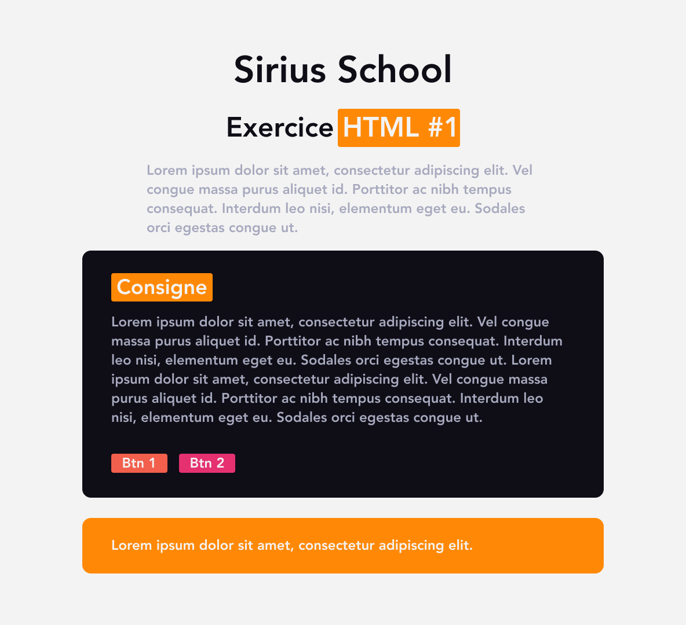
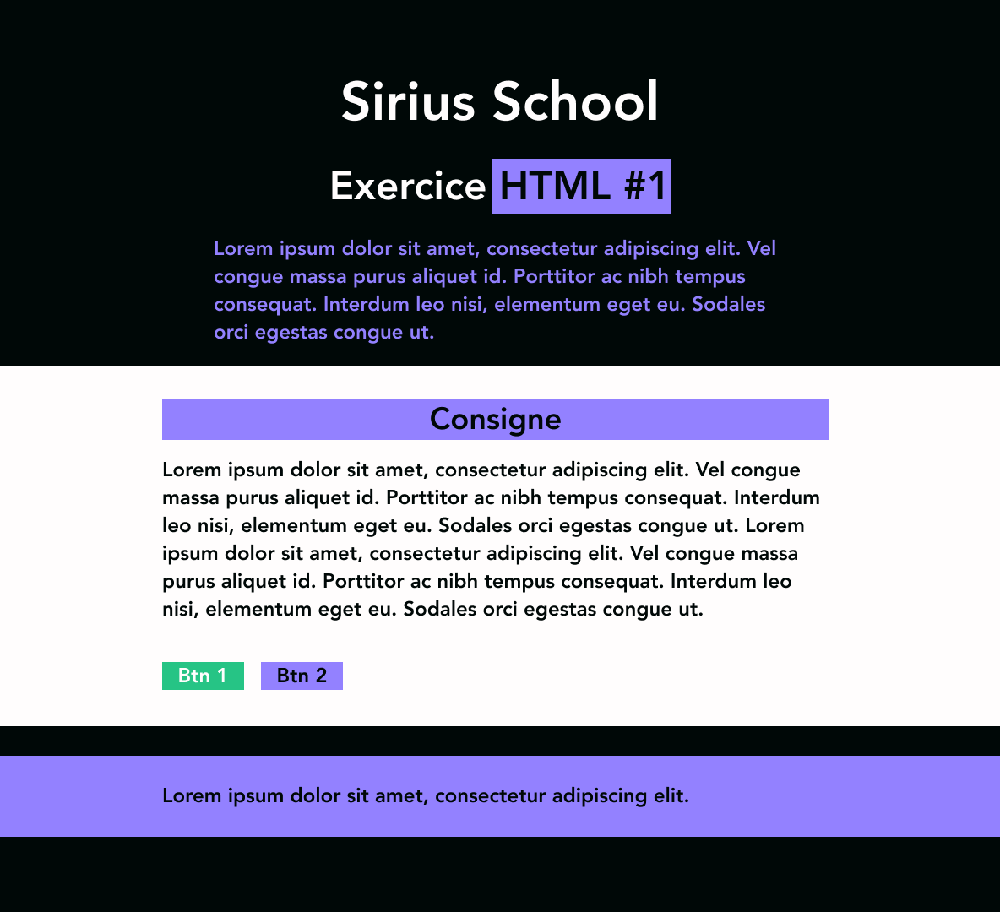

# Exercice variation style CSS

Voici encore un exercice dans lequel tu vas devoir mettre tes compétences à l'épreuve pour réaliser la maquette.

## :memo: Objectifs

- Réaliser une maquette à partir de rien
- Suivre des consignes précises
- Trouver des styles CSS qui fonctionne bien au niveau des couleurs
- Apprendre à se débrouiller en allant lire la théorie vue ou la documentation

## :white_check_mark: Evaluations

- Respect des consignes
- La syntaxe est correcte
- L'indentation est correcte

## Mise en place

1. Crée un nouveau dossier `exercices-variations` et un fichier html `index.html`.
2. Essaye de créer la structure HTML en te basant sur les screenshots plus bas.
3. Ajoute un fichier CSS `variant01.css` et reproduis le même style que sur les screenshots. Lâche toi pour les couleurs.
4. Utilise [Coolors](https://coolors.co/) ou [Adobe Color](https://color.adobe.com/fr/create/color-wheel) pour choisir des couleurs qui vont bien ensemble.
5. Change également la taille de certains élément pour proposer une autre mise en page des mêmes éléments.
6. Réalise **2 variations CSS minimum** du même fichier HTML.

## Screenshot

[:rewind: Retour au sommaire du cours](README.md#table-des-matières)
