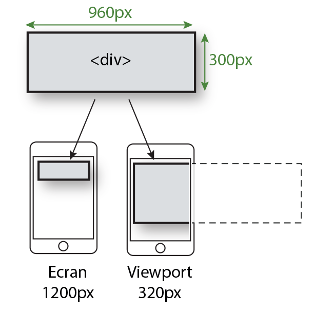
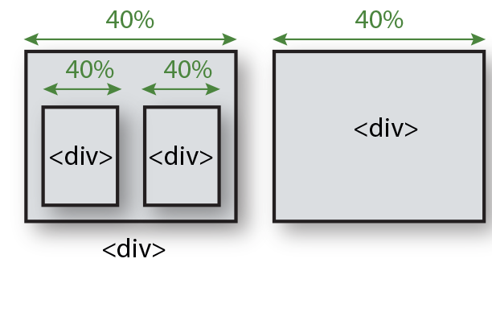
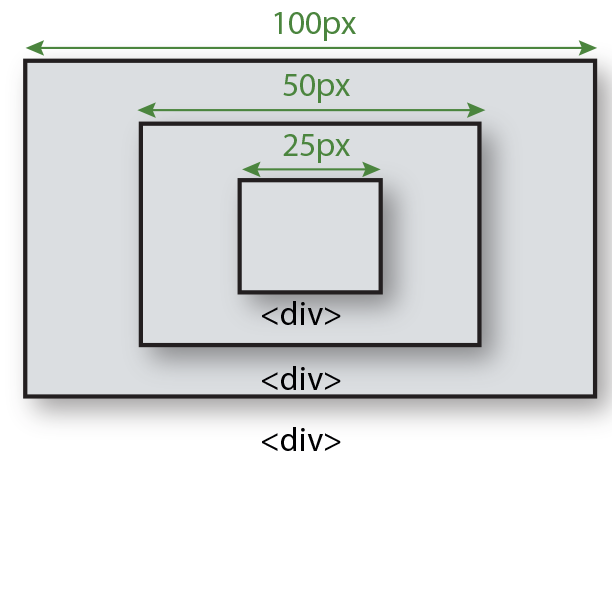
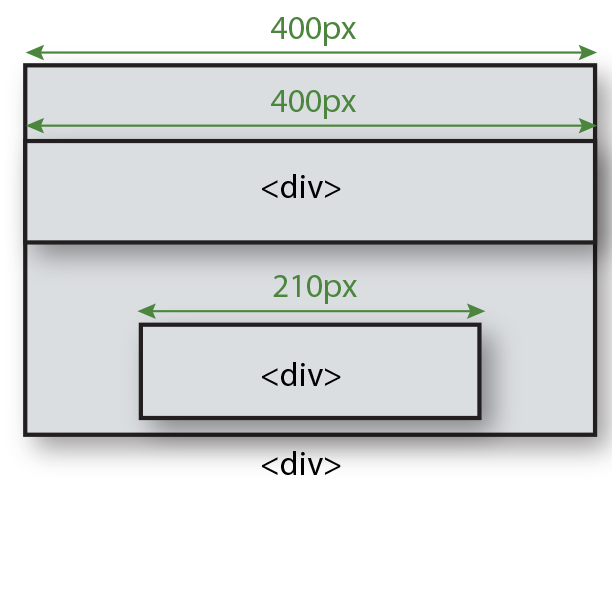
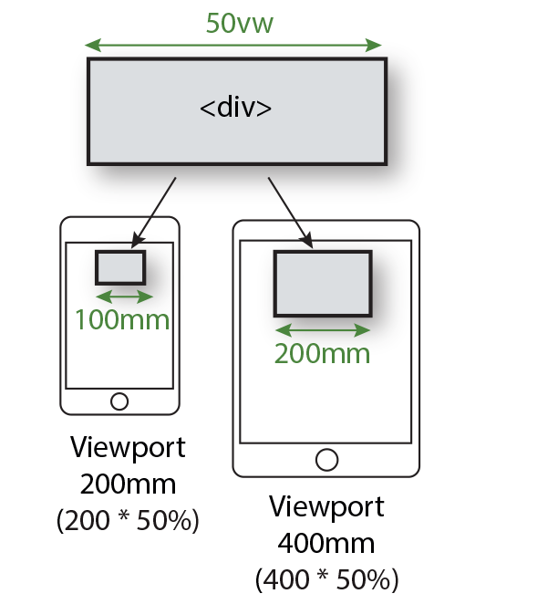
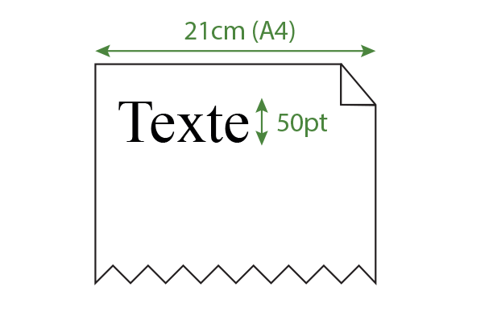
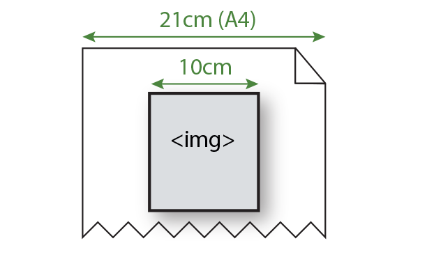
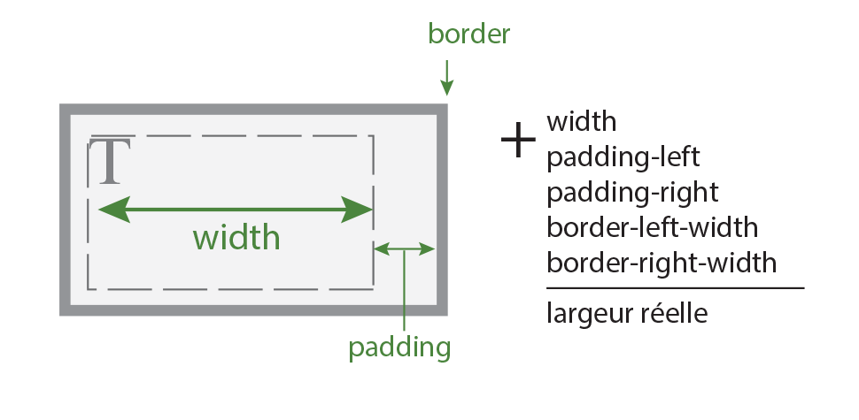
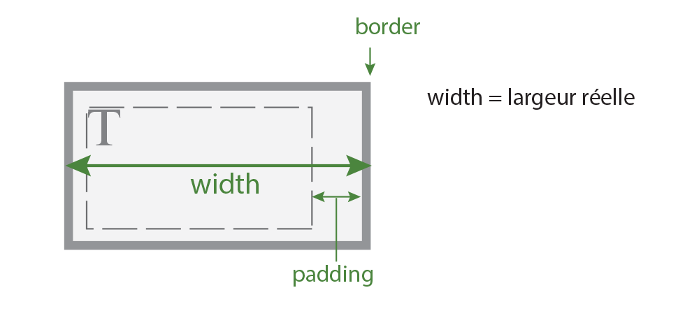

<!-- omit in toc -->
# Les unités de mesures en CSS

Lorsque l'on veut définir la taille d'un de nos éléments on a plusieurs choix concernant l'unité à utiliser. Vous avez certainement utilisé des `px` et vu des `em`, `rem`, `pt`,...Voyons ensemble à quoi correspond ces différentes unités et dans quels cas les utiliser.

<!-- omit in toc -->
## Table des matières

- [Les unités de mesures](#les-unités-de-mesures)
  - [Pixel (px)](#pixel-px)
  - [Pourcentage (%)](#pourcentage-)
  - [Emphemeral Unit (em)](#emphemeral-unit-em)
  - [rem](#rem)
  - [Viewport Width (vw) / Viewport Height (vh)](#viewport-width-vw--viewport-height-vh)
    - [vmin / vmax](#vmin--vmax)
  - [Point (pt) et Picas (pc)](#point-pt-et-picas-pc)
  - [mm / cm / in](#mm--cm--in)
- [Calcul des dimensions d'un bloc](#calcul-des-dimensions-dun-bloc)

## Les unités de mesures

### Pixel (px)

Unité de mesure en pixels. La taille des objets et des polices de caractères se réfère à la concentration de pixels de l'écran (résolution de l'écran).

On utilise les `pixels` généralement pour la largeur des bordures ou pour des éléments compris dans des designs à largeur fixe. Ils peuvent aussi servir pour le décalage des ombres en `box-shadow`.

On évite les `px` pour la typographie.

```css
div{
  width: 960px;
  min-height: 300px;
}
```



[:arrow_up: Revenir au top](#table-des-matières)

### Pourcentage (%)

Taille définie en fonction de la largeur du navigateur et ensuite des contenants parents.

On utilise les `%` sur des images ou conteneurs à taille variables/responsive.

On évite les `pourcentages` pour la typographie.

```css
div{
  width: 40%;
  margin: 5%;
  float: left;
}
```

```html
<div>
  <div></div>
  <div></div>
</div>
<div></div>
```



[:arrow_up: Revenir au top](#table-des-matières)

### Emphemeral Unit (em)

Dimension relative proportionnelle à la taille de caractère (font-size) définie pour la balise `<body>` ou dans une balise parent direct.

On utilise les `em` pour la typographie et les éléments qui lui sont liés comme les marges ou les padding. Attention toute fois que les `em`peuvent être plus compliqués à employer sur des projets plus complexe, on leur préférera les `rem`.

```css
body {font-size:16px}
p {font-size:0.75em} /* 16*0.75= 12px */
```

```css
body{
  font-size: 200px;
}
div{
  width: 0.5em;
  font-size: 0.5em;
}
```

```html
<body>
  <div>
    <div>
      <div></div>
    </div>
  </div>
</body>
```



[:arrow_up: Revenir au top](#table-des-matières)

### rem

Dimension relative proportionnelle à la taille de caractère (font-size) définie dans la balise `<html>`ou dans le sélecteur `::root`.

Le `rem`est plus global et permet de ne pas s'y perdre dans la hiérarchie de nos éléments. On fait toujours référence à `<html>`ou `::root`

```css
html{ font-size:20px; }
div:first-child{ width:20rem; } /* 400px */
div:last-child{ width:10.5rem; } /* 210px */
```

```html
<body>
  <div>
    <div></div>
    <div></div>
  </div>
</body>
```



[:arrow_up: Revenir au top](#table-des-matières)

### Viewport Width (vw) / Viewport Height (vh)

Mesures relatives à la taille du viewport (fenêtre du navigateur). Une unité représente 1% de la dimension du contenant.

On utilise les `vw` et `vh`pour les conteneurs responsive.

```css
div{width:50vw;}
```

```html
<body>
  <div></div>
</body>
```



[:arrow_up: Revenir au top](#table-des-matières)

#### vmin / vmax

Équivalent à la taille minimum ou maximum du viewport. Utilise l'orientation portrait ou paysage.

[:book:Article](http://thenewcode.com/1137/MinMaxing-Understanding-vMin-and-vMax-in-CSS)

[:arrow_up: Revenir au top](#table-des-matières)

### Point (pt) et Picas (pc)

Mesure dédiées à l'impression de caractères sur la base de 72dpi (1 inches = 72pt) pour le **p**oin**t** et sur 6dpi (1 inches = 6pc) pour le **p**i**c**as. 

On utilise les `points`et `picas`pour les feuilles de styles destinées à l'impression.

On évite ces unités pour tout autre utilisation.

```css
h1{font-size: 50pt}
```

```html
<h1>Texte</h1>
```



[:arrow_up: Revenir au top](#table-des-matières)

### mm / cm / in

Mesures dédiées à l'impression pour définir la taille d'un objet à l'impression.

On utilise les `mm`, `cm`et `in`pour les feuilles de styles destinées à l'impression.

On évite ces unités pour tout autre utilisation.

```css
img{width: 10cm;}
```

```html

```



[:arrow_up: Revenir au top](#table-des-matières)

## Calcul des dimensions d'un bloc

Par défaut la taille réelle d'un élément est calculé en prenant en compte sa width et ses border et padding. Du coup quand vous utiliser `width: 200px` votre élément ferra bien 200px jusqu'à ce que vous rajoutiez des border ou padding. Cela peut être un peu compliqué par moment surtout pour le responsive design. Du coup il est possible de changer cela grâce à la propriété `box-sizing`

```css
/* Comportement par défaut */
.element{box-sizing: content-box}
```



```css
/* Taille réelle grâce à width avec les border et margin calculé à l'avance */ 
.element{box-sizing: border-box}
```



[:book:Voir un exemple](https://www.w3schools.com/css/css3_box-sizing.asp)

[:arrow_up: Revenir au top](#table-des-matières)

[:rewind: Retour au sommaire du cours](./README.md#table-des-matières)
