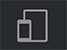
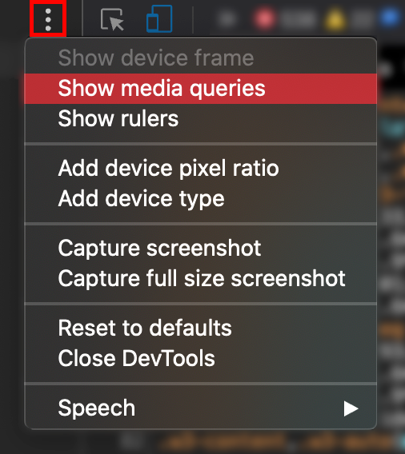
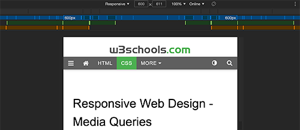

<!-- omit in toc -->
# Responsive Design

Voyons ensemble comment rendre nos pages accessibles sur tous les appareils.

<!-- omit in toc -->
## Table des matières

- [Qu'est-ce que c'est que le responsive design](#quest-ce-que-cest-que-le-responsive-design)
- [Viewport](#viewport)
  - [Comment configurer le viewport](#comment-configurer-le-viewport)
  - [Taille du contenu dans le viewport](#taille-du-contenu-dans-le-viewport)
- [Images responsive](#images-responsive)
- [Vue en grille](#vue-en-grille)
- [Media Queries](#media-queries)
  - [Ajouter un breakpoint](#ajouter-un-breakpoint)
  - [Toujours penser son site en Mobile First](#toujours-penser-son-site-en-mobile-first)
  - [Des breakpoints typiques](#des-breakpoints-typiques)
  - [Orientation: Portrait / Landscape](#orientation-portrait--landscape)
  - [Cacher des éléments](#cacher-des-éléments)
  - [Changer le taille d'une police](#changer-le-taille-dune-police)
  - [Tester ses media queries](#tester-ses-media-queries)
- [En savoir plus](#en-savoir-plus)

## Qu'est-ce que c'est que le responsive design


Le Responsive Design c'est réfléchir son design et son CSS pour que  toutes vos pages s'affichent correctement sur tous les appareils possibles (smartphone, tablet, ordinateur,...).

Le Responsive Design n'utilise que HTML et CSS. Pas de javascript ou de logiciel spécifique. On peut par contre utiliser des librairies spécifiques comme par exemple Tailwind, Bootstrap, Foundation, Skeleton,...

Une page web doit afficher toujours le même contenu correctement sur les différents appareils et ne pas en supprimer parce que sur une résolution plus petite ce contenu ne pourrais pas s'afficher. On verra que certains contenus peuvent éventuellement être caché, comme des illustrations, pour créer un peu d'espace pour le reste du contenu.

On va donc utiliser le CSS pour redimensionner, déplacer, cacher, élargir ou rapetisser nos éléments.

[:arrow_up: Revenir au top](#table-des-matières)

## Viewport

Le viewport est la partie visible à l'utilisateur d'une page web. Il varie avec l'appareil, il sera plus petit sur un smartphone que sur un écran d'ordinateur.

Avant les tablettes et smartphones, les pages web étaient conçue seulement pour les écrans d'ordinateur, et c'était commun d'avoir des pages avec une taille fixe. Du coup, lorsque les tablettes et téléphones mobile sont apparu, on ne faisait que rétrécir la taille de la page pour qu'elle s'affiche. Ca fonctionnait mais ce n'était pas toujours très lisible.

[:arrow_up: Revenir au top](#table-des-matières)

### Comment configurer le viewport

Depuis HTML5, on peut placer une balise `<meta>` qui va permettre de contrôler le viewport. Cette balise vous la voyez depuis un moment dans vos exercices:

```html
<meta name="viewport" content="width=device-width, initial-scale=1.0">
```

`width=device-width` permet de fixer la largeur de la page en fonction de la largeur de l'écran (qui varie selon l'appareil)

`initial-scale=1.0 ` permet de fixer le niveau de zoom initial au lancement de la page par le navigateur.

[Exemple de scale](https://www.w3schools.com/css/css_rwd_viewport.asp)

[:arrow_up: Revenir au top](#table-des-matières)

### Taille du contenu dans le viewport

Il faut éviter de placer des éléments qui sortiraient du viewport et qui pourraient créer du scrolling horizontale. Les utilisateurs ont l'habitudes de scroller de manière verticale, produire l'inverse pourrait amener à une mauvaise expérience utilisateur.

Il ne faut pas non plus placer des éléments qui se basent sur une largeur de viewport spécifique pour être affiché correctement. Préféré du contenu flexible qui peut s'afficher correctement dans toutes les tailles de viewport.

On va utiliser les media queries pour appliquer des styles différents à nos éléments en fonction des viewport que l'ont veut configurer.

[:arrow_up: Revenir au top](#table-des-matières)

## Images responsive

Une image responsive est une image qui se redimensionne correctement sur n'importe quelle résolution. Il y a plusieurs possibilités pour faire cela.

- Utiliser la propriété `width` en css et la valeur 100%. Ainsi l'image s'adaptera à son conteneur.
- Utiliser la propriété `max-width` en css et une valeur à ne pas dépasser. Ainsi l'image sera responsive jusqu'à la taille précisée.
- Montrer des images différentes en fonction de la largeur du viewport avec la balise HTML `<picture>`

```html
<picture>
  <source srcset="img_smallflower.jpg" media="(max-width: 600px)">
  <source srcset="img_flowers.jpg" media="(max-width: 1500px)">
  <source srcset="flowers.jpg">
  
</picture>
```

> Dans l'exemple au dessus on spécifie une balise `<picture>` qui va contenir plusieurs source avec un attribut `media` pour définir notre media query. On utilise en dernier une balise `` en tant que fallback, c'est à dire en dernier recours si les autres images ne sont plus disponibles. 

[En savoir plus](https://www.w3schools.com/tags/tag_picture.asp)

[:arrow_up: Revenir au top](#table-des-matières)

## Vue en grille

Penser son site en grille c'est une pratique pour faire du responsive design.

La plupart du temps, un site web est découpé en 12 colonnes. Chacune ayant un taille identique ou spécifique en fonction des besoins. Votre vue en grille représente 100% de la largeur du viewport.

Voici un exemple de grille de 12 colonnes en CSS. 

```css
[class*="col-"] {
  float: left;
}

.col-1 {width: 8.33%;}
.col-2 {width: 16.66%;}
.col-3 {width: 25%;}
.col-4 {width: 33.33%;}
.col-5 {width: 41.66%;}
.col-6 {width: 50%;}
.col-7 {width: 58.33%;}
.col-8 {width: 66.66%;}
.col-9 {width: 75%;}
.col-10 {width: 83.33%;}
.col-11 {width: 91.66%;}
.col-12 {width: 100%;}
```

On utilise ces classes pour définir le nombres de colonnes que notre élément doit prendre. Cette technique est notamment utilisé dans Bootstrap. Seulement telle qu'elle c'est responsive, jusqu'à un certain stade, dès que l'on passe sur une résolution fort basse, le tout est écrasé. De nouveau, on va voir les Media Queries un peu plus bas pour remédier à cela.

Ensuite en HTML il faut que l'ensemble des colonnes utilisés dans une rangée s'additionne pour faire 12. C'est mieux.

```html
<div class="row">
  <div class="col-3">...</div> <!-- 25% -->
  <div class="col-9">...</div> <!-- 75% -->
</div>
```

[Voir un exemple](https://www.w3schools.com/css/tryit.asp?filename=tryresponsive_styles)

[:arrow_up: Revenir au top](#table-des-matières)

## Media Queries

Media Query est une technique en CSS3, on utilise `@media` pour inclure des propriétés CSS qui devront être appliquées que si une certaine condition est vraie.

```css
/* Si la largeur de la fenêtre du navigateur est de 600px ou moins, le fond de body deviendra rouge*/
@media only screen and (max-width: 600px) {
  body {
    background-color: red;
  }
}
```

:book: [La documentation des MQ](https://www.w3schools.com/cssref/css3_pr_mediaquery.asp)

[:arrow_up: Revenir au top](#table-des-matières)

### Ajouter un breakpoint

Un breakpoint est donc une règle (généralement une largeur) qui doit être vraie pour appliquer les propriétés qui lui sont associées.

Dans l'exemple vu plus haut, on avait nos classes de nos 12 colonnes, mais si vous avez [regardé l'exemple](https://www.w3schools.com/css/tryit.asp?filename=tryresponsive_styles) et essayez de réduire votre fenêtre de navigateur, le site devient peu lisible une fois que le viewport est trop petit. 

On va ajouter le code suivant pour régler notre soucis:

```css
@media only screen and (max-width: 768px) {
  /* For mobile phones: */
  [class*="col-"] {
    width: 100%;
  }
}
```

Voici [le résultat](https://www.w3schools.com/css/tryit.asp?filename=tryresponsive_breakpoints)

[:arrow_up: Revenir au top](#table-des-matières)

### Toujours penser son site en Mobile First

Il est conseillé de toujours penser son site d'abord pour l'affichage sur smartphone plutôt que sur desktop. Cela permet de s'assurer d'une page plus rapide pour l'affichage sur ces petits appareils. 

Donc au lieu d'appliquer le breakpoint pour l'affichage mobile, on va le faire pour l'affichage desktop.

```css
/* For mobile phones: */
[class*="col-"] {
  width: 100%;
}

@media only screen and (min-width: 768px) {
  /* For desktop: */
  .col-1 {width: 8.33%;}
  ...
  .col-12 {width: 100%;}
}
```

[:arrow_up: Revenir au top](#table-des-matières)

### Des breakpoints typiques

Il est tout a fait possible d'ajouter autant de breakpoint que vous voulez. Voici quelques uns des plus utilisés.

```css
/* Extra small devices (phones, 600px and down) */
@media only screen and (max-width: 600px) {...}

/* Small devices (portrait tablets and large phones, 600px and up) */
@media only screen and (min-width: 600px) {...}

/* Medium devices (landscape tablets, 768px and up) */
@media only screen and (min-width: 768px) {...}

/* Large devices (laptops/desktops, 992px and up) */
@media only screen and (min-width: 992px) {...}

/* Extra large devices (large laptops and desktops, 1200px and up) */
@media only screen and (min-width: 1200px) {...}
```

[:arrow_up: Revenir au top](#table-des-matières)

### Orientation: Portrait / Landscape

Vous pouvez utiliser les media queries pour changer le style de votre page en fonction de l'orientation du navigateur.

```css
@media only screen and (orientation: landscape) {
  body {
    background-color: red;
  }
}
```

[:arrow_up: Revenir au top](#table-des-matières)

### Cacher des éléments

Il est également possible de cacher certains éléments via les media queries. Attention à ne pas masquer des infos importantes mais plutôt des éléments de style non-essentiel à votre page.

```css
/* If the screen size is 600px wide or less, hide the element */
@media only screen and (max-width: 600px) {
  div.example {
    display: none;
  }
}
```

[:arrow_up: Revenir au top](#table-des-matières)

### Changer le taille d'une police

```css
/* If the screen size is 601px or more, set the font-size of <div> to 80px */
@media only screen and (min-width: 601px) {
  div.example {
    font-size: 2em;
  }
}

/* If the screen size is 600px or less, set the font-size of <div> to 30px */
@media only screen and (max-width: 600px) {
  div.example {
    font-size: 1.5em;
  }
}
```

[:arrow_up: Revenir au top](#table-des-matières)

### Tester ses media queries

C'est bien beau de créer tout un ensemble de règles pour les différents appareils. Mais on ne fait pas ça de tête et sans tester. Pour vous aidez il n'y a pas besoin de lancer votre site sur votre smartphone ou tablette, mais à tout simplement utiliser les outils de développement de chrome/firefox.

Appuyez sur `F12` et cliquez ensuite sur l'icône suivante: 

Une fois l'interface ouverte vous pouvez sélectionner différentes résolution pré-définie, en rajouter vous même ou tout simplement utiliser le mode `responsive` pour tester la réactivité de votre site.

 **Avantage de chrome:** il est possible de "voir" vos media queries en cliquant sur les 3 petits points en haut à droite. Cela permet d'avoir une visualisation des différentes tailles configurées et de redimensionner votre site immédiatement en cliquant sur une de ces tailles.




[:arrow_up: Revenir au top](#table-des-matières)

## En savoir plus

- [Les bonnes pratiques en Responsive Design](02-rd-bonnes-pratique.md)
- [Toutes les propriétés de `@media`](https://www.w3schools.com/cssref/css3_pr_mediaquery.asp)
- [Le mode responsive de Firefox](https://developer.mozilla.org/fr/docs/Outils/Vue_adaptative)
- [Le mode responsive de Chrome](https://developers.google.com/web/tools/chrome-devtools/device-mode)

[:arrow_up: Revenir au top](#table-des-matières)

[:rewind: Retour au sommaire du cours](./README.md#table-des-matières)

