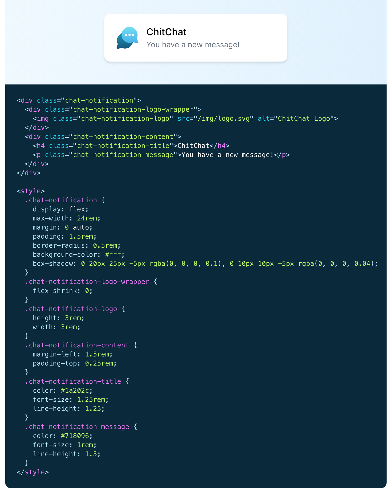

<!-- omit in toc -->
# Tailwind CSS

Tailwind est un framework CSS axé sur un côté "utility-first". Pour simplifier, il propose des classes déjà toute faite pour paramétrer vos éléments HTML directement sans écrire la moindre ligne de CSS.


<!-- omit in toc -->
## Table des matières

- [Principe](#principe)
- [Avantages et inconvénients](#avantages-et-inconvénients)
- [Installation via Tailwind Play CDN](#installation-via-tailwind-play-cdn)
- [Installation via Tailwind CLI (recommandé)](#installation-via-tailwind-cli-recommandé)
  - [Petite pause histoire](#petite-pause-histoire)
    - [Qu'est-ce que Node.js](#quest-ce-que-nodejs)
    - [Qu'est-ce que NPM](#quest-ce-que-npm)
  - [Revenons à la configuration](#revenons-à-la-configuration)
- [La Documentation](#la-documentation)
- [Plugin VSCode](#plugin-vscode)
- [Modifier la config de Tailwind (:fire: Avancé)](#modifier-la-config-de-tailwind-fire-avancé)

## Principe

Tailwind est finalement qu'une simple feuille de style css comme vous en avez déjà réalisés. Sauf qu'ici toutes les classes sont déjà pré-remplie par des propriétés et valeurs définies qui vont vous permettre d'appliquer rapidement des propriétés tels que `flex`, `color`, `width`,...




Tailwind possède un "style" propre avec des valeurs communes. Il est tout à fait possible de le configurer pour qu'il génère la feuille de style avec vos propres codes couleurs ou vos propres fonts.

La feuille de style fournie à la base est également remplie de code inutile et rallonge le temps de chargement de votre style. Il est donc possible de purger la feuille de tout bout de code non utilisés dans votre projet.

Bref, Tailwind, c'est le bien!

## Avantages et inconvénients

:white_check_mark: L'**avantage** d'utiliser un framework CSS est la possibilité de rapidement mettre en page son site sans devoir écrire des règles et sélecteurs CSS. Il suffit de connaître le nom des classes utilisées par Tailwind pour les appliquer à nos éléments HTML.

:x: Les **inconvénients** principaux sont que du coup on a des classes à rallonges et des répétitions. Ces dernières peuvent être évitées par l'utilisation d'un framework JS (React, Vue,...) mais ce n'est pas le but de ce cours.

```html
<div class="container sm:m-auto lg:w-8/12 w-screen pb-20 bg-gray-600 sm:rounded-3xl  bg-gradient-to-t to-blue-dark from-blue-light ">
  <div class="container m-auto h-28 bg-white w-full sm:rounded-t-3xl flex justify-between items-center px-10 text-black">
    
    <div class="flex">
      <a href="..."><i class="fab fa-facebook-square text-orange text-3xl mr-5"></i></a>
    </div>
  </div>
</div>
```

> Dans le code ci-dessus, il n'y a aucun code CSS écrit en plus du CSS fournit par Tailwind.

[:arrow_up: Revenir au top](#table-des-matières)

## Installation via Tailwind Play CDN

On va allez au plus simple et insérer directement le script Tailwind via CDN officiel.

```html
  <script src="https://cdn.tailwindcss.com"></script>
```

:x: L'inconvénient de ce système, c'est que l'on ne pourra pas modifier la configuration de Tailwind, comme par exemple ajouter nos propres couleurs ou font. Pour l'instant ce n'est pas grave.

Cette méthode est pratique pour la phase de Développement mais ne sera jamais utilisé en phase de Production.

[:arrow_up: Revenir au top](#table-des-matières)

## Installation via Tailwind CLI (recommandé)

La méthode du CDN étant un peu trop simple et pouvant être limitée, installons Tailwind correctement dans notre projet. Cela permettra de pouvoir utiliser [l'extension officielle](#plugin-vscode) et de faire quelques modifications à notre configuration (avancé!).

1. Ouvrons le terminal (chercher PowerShell sur Windows ou Terminal sur Mac)
2. Assurons-nous d'avoir **[NPM](https://docs.npmjs.com/downloading-and-installing-node-js-and-npm)** installé sur notre ordinateur. Pour ce faire, indiquons la commande suivante dans le terminal: `node -v; npm -v`. Si les deux commandes retourne des numéros de version, tout va bien. Sinon il va falloir allez installer celui qui est manquant.
3. (optionnel)Si il s'agit de Node qui est manquant alors [Node.js installer](https://nodejs.org/en/download/) est à installé
4. (optionnel)Si il s'agit de NPM qui est manquant alors il suffit d'exécuter la commande suivante: `npm install -g npm`

### Petite pause histoire

#### Qu'est-ce que Node.js

JavaScript est l’un des langages de programmation les plus populaires au monde. Aujourd’hui, il propulse des millions de sites web et il a attiré des masses de développeurs et de concepteurs pour créer des fonctionnalités pour le web. Si vous êtes novice en programmation, JavaScript est facilement l’un des meilleurs langages de programmation à maîtriser.

Au cours de ses 20 premières années, JavaScript a été utilisé principalement pour les scripts côté client. Étant donné que JavaScript ne pouvait être utilisé qu’à l’intérieur de la balise `<script>`, les développeurs devaient travailler dans plusieurs langages et frameworks entre les composants frontend et backend. Plus tard est apparu Node.js, qui est un environnement d’exécution comprenant tout ce qui est nécessaire pour exécuter un programme écrit en JavaScript.

Node.js est un environnement d’exécution single-thread, open-source et multi-plateforme permettant de créer des applications rapides et évolutives côté serveur et en réseau. Il fonctionne avec le moteur d’exécution JavaScript V8 et utilise une architecture d’E / S non bloquante et pilotée par les événements, ce qui le rend efficace et adapté aux applications en temps réel.

Autrement dit, Node.js est nécessaire au bon déroulement de vos frameworks et autres libraries que vous voulez utiliser dans votre projet.

> Article complet sur [kinsta.com](https://kinsta.com/fr/base-de-connaissances/qu-est-ce-que-node-js/)

#### Qu'est-ce que NPM

NPM est le gestionnaire de paquets officiel de Node.js. Sa maîtrise est obligatoire pour tout développeur voulant travailler dans cet environnement car il est présent à toutes les étapes de la création, du développement et de la maintenance des applications Node.js.

En programmation, on dit souvent qu’il ne faut pas réinventer la roue sur chaque projet. En effet, la plupart des fonctionnalités que vous voulez intégrer dans votre projet ont sûrement déjà été développées et testées par d’autres avant vous. Grâce à la puissance de la communauté open-source, vous pouvez télécharger le code de ces fonctionnalités et les installer dans votre projet en tant que dépendances pour pouvoir les réutiliser.

C’est là qu’interviennent les gestionnaires de paquets : tels d’énormes annuaires, ils listent les paquets disponibles et permettent de les télécharger, installer, mettre à jour et désinstaller très facilement.

Il automatise toute la gestion des dépendances et des paquets des projets JavaScript. Plus besoin de télécharger, installer et mettre à jour régulièrement les codes sources des différents paquets (modules, librairies, frameworks etc.) dont votre projet est dépendant.

> Article complet sur [welovedevs.com](https://welovedevs.com/fr/articles/npm/)

[:arrow_up: Revenir au top](#table-des-matières)

### Revenons à la configuration

Maintenant qu'on en sait un peu plus sur ce qu'on utilise et qu'on est sûr que tout est installé correctement, poursuivons notre installation de Tailwind.

1. Assurons-nous d'avoir créé et d'être dans un nouveau dossier pour notre projet.
2. Dans le terminal rendons-nous dans ce dossier avec la commande "cd" (Change Directory). Il faut utiliser `.` (racine), `..`(revenir un dossier en arrière) et `tab` (auto-complete)
3. Lancer les deux commandes suivantes:

```shell
npm install -D tailwindcss 
npx tailwindcss init
```

4. Une fois les commandes terminées, ouvrons le fichier `tailwind.config.js` et modifions la ligne `content`:

```js
/** @type {import('tailwindcss').Config} */
module.exports = {
  content: ["./src/**/*.{html,js}","./*.{html,js}"],
  theme: {
    extend: {},
  },
  plugins: [],
}

```

5. Créons maintenant un fichier `src/css/input.css` et ajoutons-y les directives suivantes:

```css
@tailwind base;
@tailwind components;
@tailwind utilities;
```

6. Lançons la commande qui va générer notre fichier `css`. :exclamation: Attention aux chemins si vous avez changer quelque chose lors des précédentes étapes.

```shell
npx tailwindcss -i ./src/css/input.css -o ./dist/output.css --watch
```

7. Créons notre page HTML `./src/index.html` avec le lien vers notre feuille de style fraîchement générée.

```html
<!doctype html>
<html>
<head>
  <meta charset="UTF-8">
  <meta name="viewport" content="width=device-width, initial-scale=1.0">
  <link href="/dist/output.css" rel="stylesheet">
</head>
<body>
  <h1 class="text-3xl font-bold underline">
    Hello world!
  </h1>
</body>
</html>
```


[:arrow_up: Revenir au top](#table-des-matières)

## La Documentation

Alors, maintenant il va falloir apprendre à vous débrouiller en consultant la documentation. On va la parcourir ensemble cette [documentation officielle de Tailwinds](https://tailwindcss.com/docs), en plus elle est super bien faite! Mais par après, il faudra vous même allez la consulter quand vous aurez besoin de retrouver une classe ou l'autre.

## Plugin VSCode

:exclamation: Ne fonctionne que si Tailwind à été installé via CLI ou PostCSS. **Ne fonctionne pas avec Play CDN!!**


Tailwind fournit une extension pour VSCode qui est juste parfaite. Elle vous auto-suggère des classes et si vous ne savez pas ce que fait cette classe, il suffit de passer sa souris dessus et le code CSS complet vous est montré!

[:floppy_disk: Je veux installer cette extension](https://marketplace.visualstudio.com/items?itemName=bradlc.vscode-tailwindcss)

[:arrow_up: Revenir au top](#table-des-matières)

## Modifier la config de Tailwind (:fire: Avancé)

Alors, maintenant que tu as un peu fait joujou avec Tailwind, voici quelques explications supplémentaires sur comment personnaliser un peu le thème par défaut pour le faire correspondre à nos besoin.

Tu te souviens, on a été dans le fichier `tailwind.config.js` pour demander à Tailwind de surveiller certains dossiers et/ou fichiers. Et bien c'est également là où tu vas pouvoir ajouter des couleurs ou tailles supplémentaires.

Pour ce faire, rendons-nous [dans la doc](https://tailwindcss.com/docs/theme), comme toujours.

Dans notre fichier, nous avons affaire à un objet qui contient toute la config de Tailwind. On va ajouter quelques couleurs. Cela se passe dans la partie `theme`. :exclamation: Attention, il est super-hyper-mega-important de faire attention aux accolades ( {} ). Assures-toi qu'elle soient toujours bien ouvertes et fermées correctement!! Sinon ça va mal se passer.

```js
module.exports = {
  theme: {
    colors: {
      'blue': '#1fb6ff',
      'purple': '#7e5bef',
      'pink': '#ff49db',
      'orange': '#ff7849',
      'green': '#13ce66',
      'yellow': '#ffc82c',
      'gray-dark': '#273444',
      'gray': '#8492a6',
      'gray-light': '#d3dce6',
    },
  }
}
```

Dans cet exemple, on remarque que dans la partie `colors` on a des nouveaux mot-clés (blue, purple,...) avec à chaque fois une valeur hexadécimal. Et bien ceci, ça sera vos nouvelles couleurs.

```html
<div class="bg-red-500">
  <p class="text-blue">
</div>
```

Ma classe par défaut ici `bg-red-500` me permettait d'avoir la couleur rouge par défaut de Tailwind en arrière-plan de ma div. Mais bizarrement maintenant que j'ai ajouté les nouvelles couleurs, cela ne fonctionne plus.

C'est normal, car ici on a littéralement remplacé **TOUTES** les couleurs de Tailwind, par les nôtres. Maintenant accessible comme n'importe quelle couleur auparavant avec les nouveaux mots-clés.

Mais du coup, est-ce possible d'ajouter plutôt que de remplacer? Bien sûr jeune apprentis. Cela s'appel `extend`

```js
theme: {
    extend: {
      colors: {
        'blue': '#1fb6ff',
        'purple': '#7e5bef',
        'pink': '#ff49db',
        'orange': '#ff7849',
        'green': '#13ce66',
        'yellow': '#ffc82c',
        'gray-dark': '#273444',
        'gray': '#8492a6',
        'gray-light': '#d3dce6',
    },
  },
},
```

Dans l'exemple ci-dessus, on ne remplace plus, mais on "étend" notre thème avec de nouvelles valeurs! Plutôt pratique.

Cela est possible pour toutes les valeurs par défaut de Tailwind. Donc si tu veux en savoir plus, je t'inviterai donc à.......... Allez lire [la documentation](https://tailwindcss.com/docs/theme)


[:rewind: Retour au sommaire du cours](./README.md#table-des-matières)
