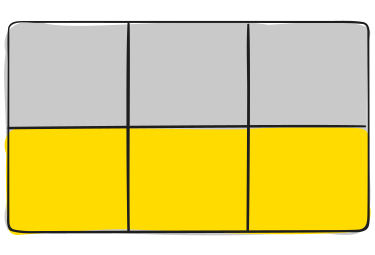
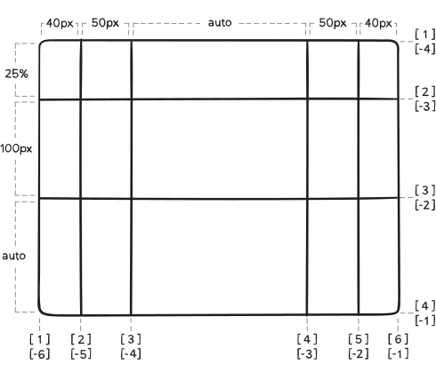

# Grid (débutant)

:exclamation: Work in progress

## Introduction

Jusqu'à maintenant on a vu des façons de réaliser vos pages simple avec float ou flexbox. Mais pour des interface un peu plus complexe on va devoir utiliser Grid. Il s'agit de découper notre page en une grille et de définir précisément chaque colone et ligne. Grid est un module CSS crée spécialement pour répondre aux besoins des designer qui devait "hacker" float et flexbox pour arriver à leurs fins.

Attention ça va devenir plus complexe, mais le but n'est pas de maîtriser Grid dès le début, mais de voir son potentiel et d'apprendre à l'utiliser au fur et à mesure de tes projets.

## Quelques termes à connaître

### Grid container

Il s'agit de l'élement qui aura la propriété **display:grid**. C'est le parent des **grid items**

```html
<div class="grid-container">
  <div class="grid-item1"></div>
  <div class="grid-item2"></div>
</div>
```

### Grid Item

C'est l'enfant direct du **grid container**.

```html
<div class="grid-container">
  <div class="grid-item1">
    <p>Je ne suis pas un grid item!</p>
  </div>
  <div class="grid-item2"></div>
</div>
```

### Grid Line

C'est la ligne qui divise la structure de notre grille. Elle peut-être horizontale ou verticale.


### Grid Cell

C'est l'espace contenu entre 4 grid line.


### Grid Track

C'est l'espace entre 2 grid line adjacente. On peut voir ça comme une colone ou une rangée. 



### Grid Area

L'espace compris entre 4 grid line. Il peut être composé de plusieurs grid cell.


## Comment ça fonctionne

### Grid-container

#### display

Comme d'habitude on va définir notre élément principale comme grid.

```css
.grid-container{
  display: grid; /*inline-grid*/
}
```

[Voir en pratique](https://www.w3schools.com/css/css_grid.asp)

#### grid-template-columns & grid-template-rows

Ces deux propriétés vont définir la taille et le nom de nos colonnes et rangées. Il suffit de placer une valeur suivie d'une barre verticale (|) et d'une deuxième valeur. Cette valeur peut-être donnée en **px**, en **%** ou en **fr** .

```css
.grid-container {
  grid-template-columns: 40px 50px auto 50px 40px;
  grid-template-rows: 25% 100px auto;
}
```

> Dans ce cas-ci nous auront 5 colonnes de tailles variables et 3 rangées.



> Par défaut ces lines auront une valeur numérique positive et négative qui leurs sont attribués. Mais il est possible de définir leurs noms. Voyons cela.

Pour donner un nom aux lines il suffit de placer ce nom devant la valeur et entre crochets ([]).

```css
.grid-container {
  grid-template-columns: [first] 40px [line2] 50px [line3] auto [col4-start] 50px [five] 40px [end];
  grid-template-rows: [row1-start] 25% [row1-end] 100px [third-line] auto [last-line];
}
```


##### valeur fractions

Il est possible d'utiliser une fraction de l'espace disponible. Pour ce faire on utilise **fr**

```css
.grid-container{
  grid-template-columns: 1fr 1fr 1fr;
}
```

> Ceci aura pour but de prendre 1/3 de l'espace disponible.

#### grid-template-areas

Il est également possible de définir notre grid avec le nom que l'on donne à nos grid-area. pour ce faire on écrit le nom de notre grid-area suivi d'un espace et d'une autre grid-area ou d'un point. Si on place un point cela signifie qu'on définit une grid cell vide. 

```css
  .container {
    display: grid;
    grid-template-columns: 1fr 1fr 0.5fr 1fr;
    grid-template-rows: auto;
    grid-template-areas: 
      "header header header header"
      "main main . sidebar"
      "footer footer footer footer";
  }
.item-a {
  grid-area: header;
  background-color: coral;
}
.item-b {
  grid-area: main;
  background-color: yellowgreen;
}
.item-c {
  grid-area: sidebar;
  background-color: crimson;
}
.item-d {
  grid-area: footer;
  background-color: dodgerblue;
}
```


#### grid-template

Permet d'écrire **grid-template-rows**, **grid-template-columns** et **grid-template-areas** en une seule ligne.

```css
.grid-container {
  grid-template:
    [row1-start] "header header header" 25px [row1-end]
    [row2-start] "footer footer footer" 25px [row2-end]
    / auto 50px auto;
}
```

#### grid-gap

Il est possible de gérer l'intersection entre les colonnes et rangées. C'est ce qu'on appel le **gap**. On peut mettre une valeur en **px**.

```css
.grid-container {
  display: grid;
  grid-gap: 50px;
}
```

> Dans ce cas-ci, tous les espaces entres colonnes et rangées auront un gap de 50px. Mais il est possible de définir les rangée et puis les colonnes en plaçant 2 valeurs à la suite. Il est également possible d'utiliser les propriétés **grid-row-gap** et **grid-columns-gap**.


#### justify-content

Permet d'aligner l'entièreté de la grille à l'intérieur du container. Prends les valeurs: **space-evenly**, **space-around**, **space-between**, **strech**, **center**, **start** et **end**.

[Voir en pratique](https://css-tricks.com/snippets/css/complete-guide-grid/#prop-justify-content)

#### align-content

Permet d'aligner l'entièreté de la grille de façon verticale à l'intérieur du container. Prends les valeurs: **space-evenly**, **space-around**, **space-between**, **strech**, **center**, **start** et **end**.

[Voir en pratique](https://css-tricks.com/snippets/css/complete-guide-grid/#prop-align-content)

### Grid-item

Maintenant que l'on a vu comment définir notre grille, voyons comment placer les éléments dedans.

#### grid-column

Cette propriété permet de définir à partir de quelle colonne commence et à laquelle se termine notre élément. Pour ce faire on indique une valeur de départ et on sépare celle de fin par un slash (/)

```css
.grid-item1{
  grid-column: 1 / 5;
}
```

On peut également utiliser "span" pour définir le nombre de colone que l'élément prendra.

```css
.grid-item2{
  grid-column: 1 / span 3;
}
```

> :bulb: grid-column est une propriété raccourcie pour **grid-column-start** et **grid-column-end**.

#### grid-row

Fonctionne comme *grid-column* mais pour les rangées.

> :bulb: grid-row est une propriété raccourcie pour **grid-row-start** et **grid-row-end**.

#### grid-area

Permet de définir **grid-row-start**, **grid-column-start**, **grid-row-end** et **grid-column-end** en une seule ligne.

```css
.grid-item1{
  grid-area: 1 / 2 / 5 / 6;
}
```

Comme on l'a vu plus haut, on peut créer un template avec le grid-area. Si on nomme notre élément dans la propriété **grid-area** on peut y faire référence dans **grid-template-areas**.

## On s'arrête là pour le moment

Cela fait déjà beaucoup de théorie à pratiquer. Les grids ne sont pas faciles à créer de toute pièces, il existe différents outils pour vous aider, mais il est important d'en comprendre l'essence principale pour pouvoir plus facilement les modifier.

## Un petit jeu

Tout comme pour Flexbox, voici un jeu pour vous apprendre à utiliser grid. Essayer d'allez le plus loin possible.

[CSSGridGarden](https://cssgridgarden.com/#fr)

## Quelques liens utiles

[Layoutit!](https://grid.layoutit.com/) Permet de créer ses grilles en ligne.

[Complete guide to Grid](https://css-tricks.com/snippets/css/complete-guide-grid)