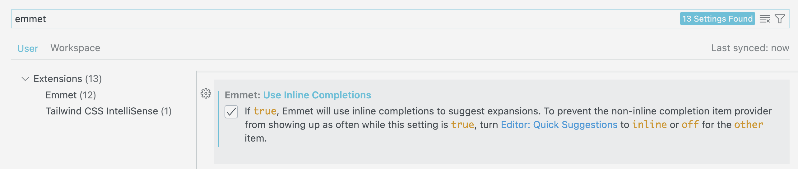

<!-- omit in toc -->
# VSCode - les astuces qui vous facilitent la vie

Voilà maintenant un moment que tu utilises VSCode comme éditeur de code. C'est un outil merveilleux avec pleins de fonctionnalités, même trop par rapport à ce que l'on a besoin nous pour cette formation.

Voyons quelques astuces qui peuvent t'aider à utiliser ce logiciel au mieux

<!-- omit in toc -->
## Table des matières

- [Emmet](#emmet)
  - [Structure HTML](#structure-html)
  - [Lorem Ipsum](#lorem-ipsum)
  - [Les listes](#les-listes)
  - [Contenu, Class et ID, multiplicateur, Attribut](#contenu-class-et-id-multiplicateur-attribut)
  - [Et en JavaScript ?](#et-en-javascript-)
  - [Cheat Sheet Emmet](#cheat-sheet-emmet)
- [Extensions](#extensions)
  - [Live Server](#live-server)
  - [Prettier](#prettier)
  - [Le reste ?](#le-reste-)
- [Raccourcis](#raccourcis)
  - [Les basiques](#les-basiques)
  - [Les flèches](#les-flèches)
  - [`Alt` + flèches](#alt--flèches)
  - [`Alt` + `Shift` + flèches](#alt--shift--flèches)
  - [`Ctrl` + `Shift` + P](#ctrl--shift--p)
  - [`Alt` + curseur](#alt--curseur)
  - [`Ctrl` + `Suppr`](#ctrl--suppr)
  - [`Double-clic`](#double-clic)
  - [`Maj` + `Suppr`](#maj--suppr)
  - [Encore plein d'autres](#encore-plein-dautres)

## Emmet

On en a déjà parlé, il s'agit d'un petit plugin directement intégré à VSCode qui permet de taper du code HTML, CSS et JS beaucoup plus rapidement. Alors, ça demande un petit temps d'apprentissage aussi pour l'utiliser, mais ça simplifie grandement la vie.

Pour pouvoir l'utiliser correctement il faut bien être dans un document HTML ou CSS ou JS. Donc pense bien à l'enregistrer.

Ensuite dès qu'on rentre le nom d'une balise on a déjà Emmet qui te propose de créer les deux balises directement, plus besoin de le faire toi même.

Voici quelques exemples :

### Structure HTML

En écrivant juste `!` et en validant avec `enter` tu peux directement créer ton squelette HTML de base.

> :exclamation: Lors d'une mise à jour de VScode il est possible que cette dernière fonctionnalité ai changée. Il faut désormais activer `Emmet: Use Inline Completions` qui est un paramètre à  dans VSCode. Ainsi, lorsque tu écriras du code Emmet, VScode te montrera directement le résultat et il faudra valider avec `Tab`.

### Lorem Ipsum

Le lorem ipsum est un texte fictif en latin qui est devenu la référence du texte de substitution. C'est à dire un texte que l'on utilise pour remplir nos `
` et `
` dans le but de pouvoir commencer rapidement à styliser notre page, sans devoir attendre le contenu complet.

Pour l'utiliser il suffit d'écrire `lorem` et de valider avec `enter`. Cela va créer un paragraphe de Lorem Ipsum. Si tu veux plusieurs paragraphes tu peux utiliser la commande suivante `lorem*2` qui du coup te créera 2 paragraphe.

### Les listes

Il est également possible de créer des listes plus rapidement, pour ce faire tu n'a qu'a écrire le type de liste que tu veux (`ul`ou `ol`).

Mais ça va plus loin que ça, il y a moyen de directement écrire le nombre de `li` dont tu as besoin dans ta liste: `ul>li*5`. Ceci va créer une liste avec 5 `<li>`. C'est à ça que sert `>`,c'est pour indiquer la descendance / l'enfant.

Et on peut encore pousser le vice plus loin en demandant directement de nous créer une liste et son contenu: `ul>li{lien $}*5`. Ce qui est entre accolades ici c'est le contenu de ma balise `<li>`.

### Contenu, Class et ID, multiplicateur, Attribut

Comme vu plus haut il y a donc moyen de préciser à Emmet le contenu de notre balise en utilisant les `{}`. Il est également possible de lui demander de compter pour nous le nombre d'élément qu'il crée en utilisant `$`, cela va ajouter un chiffre pour chaque fois qu'il doit répéter l'opération avec `*x`

C'est possible de donner la valeur d'un attribut également en utilisant `[]`. Il suffit d'écrire le nom de l'attribut de notre balise comme dans cet exemple: `a[href="#"]`

Il est également possible de préciser la classe ou l'id de notre élément directement: `div.ma-classe` ou `div#monID`

Du coup on peut combiner le tout: `(div.ma-classe#monID$>p>lorem)*5`. Ici ce qui est en parenthèse va être répéter 5 fois. On a un div avec une classe, une id unique et une balise `
` à l'intérieur contenant chacun un paragraphe de Lorem, le tout qui se répète 5 fois. ***Très pratique !***

### Et en JavaScript ?

Bien sur qu'Emmet fonctionne aussi ! Il est capable de vous proposer directement vos variables et même vos fonctions ! Tous les mots-clés que nous utiliserons durant la formation vous seront proposés par Emmet, profitez-en et gardez votre doigt prêt à appuyer sur `Tab`. Par exemple, rien qu'en tapant `fo` il me proposera la boucle `for` et même la boucle `forEach`.

### Cheat Sheet Emmet

Bref, vous l'aurez compris, Emmet c'est top quand on apprend à l'utiliser. Alors c'est à vous de faire la démarche, ici je n'ai montré que quelques exemples, mais il y a encore tellement plus.

Voici [un lien vers une Cheat Sheet](https://docs.emmet.io/cheat-sheet/) et un autre vers [la documentation](https://docs.emmet.io/)

[:arrow_up: Revenir au top](#table-des-matières)

## Extensions

Vous pouvez personnaliser votre expérience avec VSCode au fur et à mesure de votre apprentissage et de votre carrière grâce aux extensions. Ces petits bouts de code qui vont venir vous filer un coup de main pour écrire votre code ou modifier le comportement de VSCode.

Normalement sur votre machine, vous avez déjà quelques extensions installées. Nous n'en verrons que l'une ou l'autre.

### Live Server

Live Server permet de simuler un serveur sur votre machine pour voir comment se comporte votre site. Alors dans cette section on ne va pas l'utiliser pleinement. Cependant il a une utilité très intéressant, c'est la prévisualisation et le "refresh live". C'est à dire qu'à chaque fois que vous enregistrez votre page, votre aperçu se met à jour sans que vous deviez rafraîchir votre page.

Pour utiliser Live Server, il suffit d'ouvrir non pas un fichier avec VSCode, mais un dossier. Vous retrouverez dans la barre latéral l'onglet avec vos fichiers, si vous cliquez droit dessus vous aurez l'option `Open with Live Server`. Vous pouvez aussi démarrer l'extension en cliquant sur `Go Live` en bas à droite de votre fenêtre VSCode.

### Prettier

Une petite extension qui va vous faciliter la vie. Comme son nom l'indique elle permettra d'embellir votre code. Une fois bien **configurée**, lorsque vous effectuerez une sauvegarde `Ctrl+S` votre code sera formaté pour correspondre à la mise en page par défaut. Vous pouvez modifier ce formatage par défaut dans les paramètres de l'extension et de VSCode.

Si pour x ou y raison vous ne souhaitez pas qu'une partie de votre code soit formatée, il vous suffira de mettre en commentaire `prettier-ignore` juste au-dessus de la ligne.

>🛑⚠❌ **Attention** Je préfère que vous n'utilisiez pas cette extension pour le début de la formation. Tout simplement pour vous habituer
à coder avec l'indentation et la mise en page qu'il faut pour bien débuter. Nous l'installerons et configurerons ensemble plus tard. 

### Le reste ?  

Il y a évidement des centaines, des milliers d'extensions. Vous pouvez par exemple installer des thèmes pour votre logiciel ou d'autres extensions qui gère la mise en forme du code.

[:arrow_up: Revenir au top](#table-des-matières)

## Raccourcis

### Les basiques

- `Ctrl` + `X` : couper.
- `Ctrl` + `C` : copier.
- `Ctrl` + `V` : coller.
- `Ctrl` + `S` : sauvegarder.
- `Ctrl` + `Z` : annuler.
- `Ctrl` + `Y` : refaire.
- `Ctrl` + `F` : rechercher.
- `Ctrl` + `A` : sélectionner tout.
- `Ctrl` + `D` : sélection multiple.
- `Ctrl` + `L` : sélectionner une ligne entière.
- `Ctrl` + `J` : terminal VSCode.
- `Alt` + `Tab` : naviguer entre vos fênetres.

### Les flèches

Ce n'est pas un raccourcis lié à VSCode, mais il est très important d'apprendre à naviguer dans son code à l'aide des flèches. Normalement on garde ses deux mains sur le clavier et ainsi on a plus facile à rectifier du code en utilisant les flèches.

### `Alt` + flèches

L'utilisation de `alt` est super importante quand vous coder dans VSCode. Le fait de maintenir `alt` et d'ensuite utiliser les flèches haut et bas de votre clavier permet de déplacer une ligne de code. Bien plus pratique que d'utiliser un copier/coller.

### `Alt` + `Shift` + flèches

Ce raccourci permet de dupliquer la ligne sur laquelle se trouve votre curseur actuellement ou la sélection.

### `Ctrl` + `Shift` + P

Ce raccourci permet de faire apparaître la palette de VSCode. Dedans vous pouvez y retrouver différents raccourcis comme celui des préférences ou de vos extensions. Cela est possible tant que `>` se situe devant votre recherche, mais si vous l'effacez vous pouvez aussi rechercher des fichiers ! (vous pouvez aussi faire `Ctrl`+`P` pour accèder aux fichiers).

### `Alt` + curseur

Ce raccourci permet de placer de multiple curseur dans votre document.

### `Ctrl` + `Suppr`

Ce raccourci permet de supprimer toute la ligne où est votre curseur.

### `Double-clic`

Ce n'est pas vraiment un raccourci mais il vous permettra de sélectionner un seul mot.

### `Maj` + `Suppr`

Ce raccourci permet de supprimer une ligne entière.

### Encore plein d'autres

Naviguer dans les raccourcis VSCode via ce chemin : `File > Preferences > Keyboard Shortcuts.`

[Documentation des raccourcis VsCode](https://code.visualstudio.com/docs/getstarted/keybindings)

[:arrow_up: Revenir au top](#table-des-matières)

[:rewind: Retour au sommaire du cours](../README.md#au-programme)

> Made by [Jeremy Scala](https://github.com/scalajeremy)
>
> Edited by [Lucas Ielli](https://github.com/lucasielli)