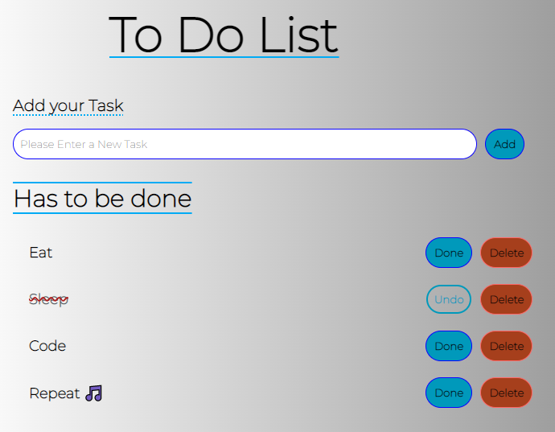

# Le projet Todo list !

Après la calculatrice, on augmente d'un cran le niveau, cet exercice fera appel à vos connaissances récemment acquises mais aussi à votre rapidité maintenant que vous êtes un peu plus habitué à votre éditeur préféré VSCode 😜 Pour vous donner une idée des fonctionnalités vous avez une image en bas de page 😀

### Avant de commencer :

- Vous aurez 5 jours entiers pour réaliser ce projet ⏰
- Vous aurez largement le temps pour débuguer, gérer les erreurs et refactoriser votre code 🧠
- Passer ce délai nous analyserons ensemble chaque projet 🤲
- N'oubliez pas d'être fier de votre projet, alors donnez-vous les moyens de réussir ! 🥰
- Votre code doit être presque parfait à vos yeux ✨ 

### Structurer :

- Créer votre repositery sur Github.com.
- N'oubliez pas de créer une branche `development`
- Quand le projet sera fini `merge` sur `main`
- Créer un readme simple et efficace en [MarkDown](https://www.markdownguide.org/cheat-sheet/).
- Créer votre structure de fichiers.
- Créer votre squelette HTML.
- Spécifier qui est l'auteur du code, donc vous 😉
- Créer un lien image qui renvoit vers votre Github.

### Styliser :

- CSS simple et minimaliste.
- Utiliser une police importée.
- Utiliser un linear-gradient.
- Utiliser display: flex;
- Facultatif : essayer d'utiliser des variables CSS 😋

### Scripter :

- Faire apparaitre la ligne de tâche avec les boutons associés `Done` & `Delete`.
- Une fois l'événement `Done` effectué, donner la possibilité d'annuler `Undo`.
- Une tâche terminée doit être visible *mais* doit changer de style.
- Le nommage de chacune de vos variables et functions doit être clair.
- Vous veillerez à limiter le nombre de caratères possibles.
- Enregistrer toutes les tâches dans votre navigateur !

⚠ Ne copiez pas bêtement un code trouvé sur internet ! (Je veille 😈)

> N'oubliez pas de **commit** quand il faut, surtout de **push** votre travail à la fin et de m'envoyer le lien du repo sur Discord !

# Bonne chance ! 😁🤝

> Created by Lucas Ielli