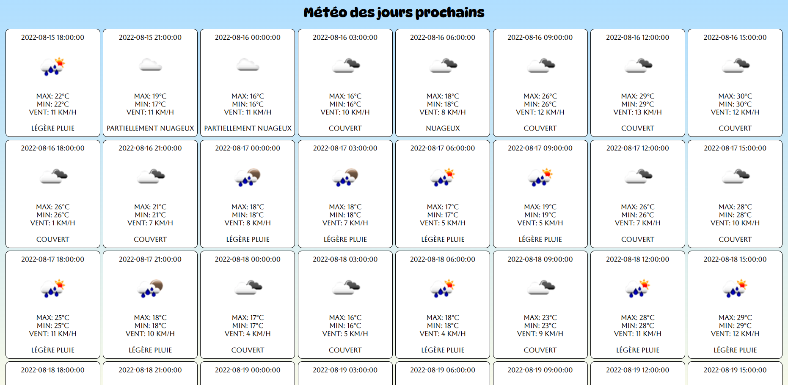

# Exercice application Météo

Vous allez devoir créer entièrement une application météorologique, pour ce faire suivez les étapes :

1. Rendez-vous sur https://openweathermap.org/forecast5, **OpenWeather** vous propose une API totalement gratuite, c'est loin d'être la meilleure mais ça fera l'affaire ! Ne vous étonnez pas si les valeurs ne sont pas toujours justes.
2. Lisez-bien la documentation et obtenez une **clé API**, vous êtes obligés de vous enregistrer sur le site pour obtenir une.
3. En attendant que votre clé soit activée, commencé votre projet 😉
4. Comme d'habitude > repository > structure > commits > npm
5. En HTML vous ***devez*** utilisez la balise `<template>` ! Qui sera votre meilleure alliée lorsque vous devrez faire votre injection JavaScript.
6. Au niveau CSS vous ***devez*** utiliser ``SASS`` !
    - Rester minimaliste comme à notre habitude dans cette formation.
    - Par contre votre site devra être **responsive**, ce sera très facile à faire. Vous n'aurez même pas besoin de "media queries".
7. Au niveau du script vous devez avoir pour chaque jour :
    - La météo de Liège. (**BONUS** donner la possibilité à l'utilisateur d'entrer la ville de son choix, Liège par défaut). 
    - La date *ou* le jour. (Exemple : 2022-08-15 *ou* Lundi).
    - Une image en rapport avec le temps qu'il fera ! Si il fait beau, une petite image d'un grand soleil. (Pssst : c'est dispo dans l'API 😁).
    - La température minimale et maximale en degré **Celsius**.
    - La vitesse du vent, attention la vraie vitesse du vent en **km/h**.
    - Pour finir une petite description (Exemple : légère pluie, couvert, etc...).
    - Tout ces informations sont disponibles dans l'API, il faut juste chercher et bien les appeler.
    - Dernier conseil utilisez ``fetch()`` vous ne pouvez pas télécharger l'intégralité de l'API, le but est que ce soit dynamique et mis à jour en temps réel.

### Exemple de ce qui vous est demandé, c'est un exemple ca ne doit PAS être exactement la même chose.

> Created by Lucas Ielli