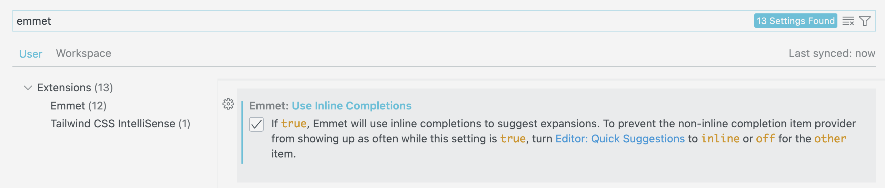

<!-- omit in toc -->
# Les bases d'HTML

Voyons ensemble de quoi est constitué une page HTML typique. Ensuite on verra vos premières balises pour tout doucement façonner votre page. On terminera avec l'utilisation des tableaux et des listes.

<!-- omit in toc -->
## Table des matières

- [Le squelette d'une page HTML](#le-squelette-dune-page-html)
- [Les balises](#les-balises)
  - [Principe d'une balise](#principe-dune-balise)
  - [Attributs et valeurs](#attributs-et-valeurs)
- [La notion de Doctype](#la-notion-de-doctype)
- [La balise `<html>`](#la-balise-html)
- [La balise `<head>`](#la-balise-head)
  - [La balise `<title>`](#la-balise-title)
- [Les balises `<meta>`](#les-balises-meta)
- [La balise `<body>`](#la-balise-body)
- [Et si j'oublie une balise ou bien de la fermer](#et-si-joublie-une-balise-ou-bien-de-la-fermer)
- [Les commentaires en HTML](#les-commentaires-en-html)

## Le squelette d'une page HTML

```html
<!DOCTYPE html>
<html lang="en">
<head>
  <meta charset="UTF-8">
  <meta name="viewport" content="width=device-width, initial-scale=1.0">
  <title>Document</title>
</head>
<body>
  
</body>
</html>
```

> Voici un exemple de page HTML toute simple. Analysons un peu tout ça.

[:arrow_up: Revenir au top](#table-des-matières)

## Les balises

Ce sont tous ces mots étranges entre `< >`. Sans les balises HTML, une page ne serait qu'un simple bloc texte. Ce sont elles qui structurent le contenu de la page. Ces balises seront interprétées par le navigateur pour lui permettre d'afficher correctement votre page à l'utilisateur.

Elles peuvent être imbriquées l'une dans l'autre.

[:arrow_up: Revenir au top](#table-des-matières)

### Principe d'une balise

On commence toujours par la balise entrante, puis le contenu, ensuite on referme la balise.

```html
<p>Salut</p>
```

> Le nom de la balise se met entre `< >`, ce nom est définit dans les spécifications HTML, on ne met pas ce que l'on veut.

[:arrow_up: Revenir au top](#table-des-matières)

### Attributs et valeurs

Certaines balises peuvent se voir attribuer des attributs. Ils permettent de préciser certains paramètres (par exemple: l'adresse d'un lien, la source d'une image, le style d'une div,...)

```html

```

> Ici `src` est l'attribut et `mon lien` la valeur. Nous verrons des balises plus précisément un peu plus loin.

[:arrow_up: Revenir au top](#table-des-matières)

## La notion de Doctype

```html
<!doctype html>
```

- Indique au navigateur quel version d'HTML on utilise sur cette page.
- Obligatoire pour valider sa page (W3C)
- Si il n'est pas renseigné vous risquez d'avoir des bugs de rétro-compatibilité, surtout sur des navigateurs plus anciens.

[:arrow_up: Revenir au top](#table-des-matières)

## La balise `<html>`

C'est elle qui ouvre et ferme tout votre code. Il est obligatoire d'ajouter les balises `<head>` et `<body>` entre votre balise `<html>`.

```html
<html lang="fr">
```

Cette balise prend généralement l'attribut `lang` qui permet de définir la langue de votre page. Cela permet une meilleur indexation pour les moteurs de recherches, aide à la synthèse vocale et permet la vérification orthographique des formulaires.

[:arrow_up: Revenir au top](#table-des-matières)

## La balise `<head>`

Elle détermine l'entête du document et contient les méta-informations (infos concernant la page). Ce sont des infos qui ne sont pas visibles des visiteurs de votre page mais qui servent aux moteurs de recherches notamment. On peut aussi y insérer des règles de styles pour votre page (mais ce n'est pas recommandé).

[:arrow_up: Revenir au top](#table-des-matières)

### La balise `<title>`

```html
<title>Le titre de ma super page HTML</title>
```

Elle est contenue dans la balise `<head>` et permet de donner un titre à votre page.

[:arrow_up: Revenir au top](#table-des-matières)

## Les balises `<meta>`

```html
<meta charset="UTF-8">
```

Il existe plusieurs type de balise meta. Elles servent notamment à définir quel set de caractères la page utilise, le nom de l'auteur de la page, des mots-clés, une description,... Tout cela aide la navigateur et les moteurs de recherches.

Quelques exemples de balises `<meta>`:

```html
<meta name="description" content="Ma première page web">
<meta name="author" content="Jeremy Scala">
<meta name="keywords" content="html, css, tutorials">
<meta name="viewport" content="width=device-width, initial-scale=1.0">
```

> Leurs noms sont plutôt explicite.

[:arrow_up: Revenir au top](#table-des-matières)

## La balise `<body>`

C'est elle qui contient le contenu de la page. On y met toutes les balises de textes, d'images, de liens,...

[:arrow_up: Revenir au top](#table-des-matières)

## Et si j'oublie une balise ou bien de la fermer

Et bien ton navigateur est plutôt intelligent et va de lui même essayer de comprendre ce que tu lui as dis. Mais comme quand tu parles dans la vie de tous les jours, si tu oublies des mots on a plus de mal à te comprendre ce qui peut parfois mener à des incohérence. Et bien c'est pareil pour une page HTML. Si tu oublies la balise `<body>` ta page s'affichera sûrement correctement car ce sont tes premières pages, mais sur un vrai projet plus complexe cela risque fortement de poser problème! Alors soit vigilant et vérifie que tu respectes toujours la structure de base d'une page HTML et que toutes tes balises sont fermées. Normalement avec un outil tel que VSCode cela devrait être facile!

## Les commentaires en HTML

Les commentaires dans le code sont une bonne pratique à avoir. Ils permettent de donner des informations complémentaires à ceux qui retravaillerons dans votre code. Généralement pour l'HTML, vu que c'est la base, il y a peu d'intérêt de commenter. Mais cela peut-être une bonne manière de vous organiser, surtout au début.

```html
<p> Je suis un texte visible <!-- je suis un commentaire invisible --></p>
```

Faisons une toute petite pause théorique. 

*Petit exercice:* Ouvrez VSCode et essayer de recréer un squelette HTML simple sans regarder l'exemple tout au dessus.

:bulb: Tu ne dois pas retenir ce squelette par coeur. Tu peux utiliser Emmet pour mettre en page rapidement ta structure de base HTML. Pour ce faire, enregistre ton document en `.html`. Ensuite dedans, tu peux tout simplement écrire `!` et valider avec la touche `Enter`. VSCode comprendra que tu utilises une abréviation d'Emmet et te mettra en place ta structure. Nous verrons Emmet un peu plus loin...

> :exclamation: Lors d'une mise à jour de VScode il est possible que cette dernière fonctionnalité ai changée. Il faut désormais activer `Emmet: Use Inline Completions` qui est un paramètre à  dans VSCode. Ainsi, lorsque tu écriras du code Emmet, VScode te montrera directement le résultat et il faudra valider avec `Tab`.



[:rewind: Retour au sommaire du cours](./README.md#table-des-matières)

[:arrow_up: Revenir au top](#table-des-matières)
