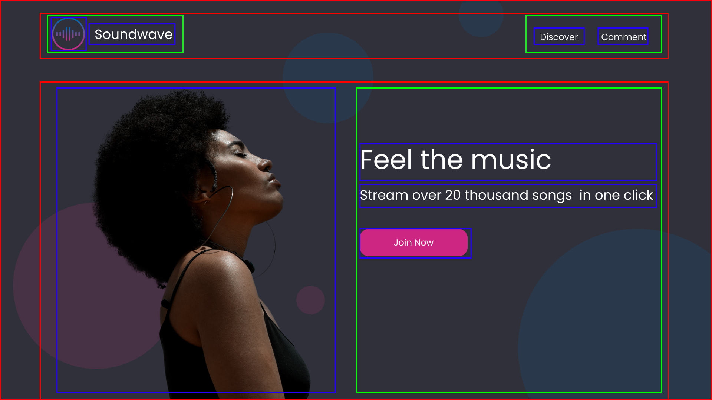
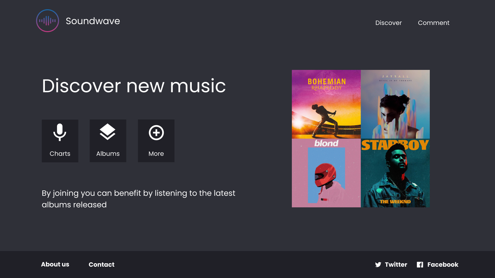
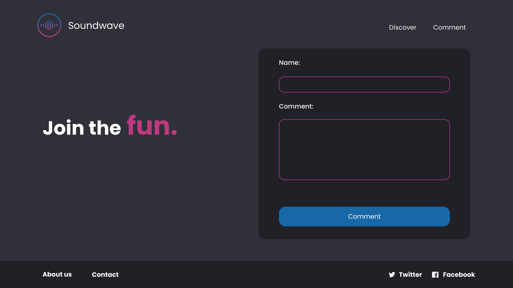

<!-- omit in toc -->
# Maquette Feel The Music

Il est temps de mettre en pratique toutes tes connaissances. Tu vas devoir réaliser une maquette complète! Il va falloir utiliser Flexbox pour la mettre en page!

Ton designer t'as envoyé le design en screenshot. À toi de le reproduire en HTML le plus fidèlement possible.

## :memo: Objectifs

- Réaliser une maquette sans HTML et CSS de base.
- Suivre des consignes précises.
- Apprendre à se débrouiller en allant lire la théorie vue ou la documentation.

## :white_check_mark: Evaluations

- Respect des consignes.
- La syntaxe est correcte.
- L'indentation est correcte.

## Consignes

- Sois le plus fidèle possible au modèle
- Chaque page doit contenir le même header et footer. Soit tu le fais sur une page et tu recopies le code sur les autres, soit tu utilises [le "hack" en JQuerry](#en-jquery) expliqué plus bas.
  - **Le header**: doit contenir le logo et le titre à gauche. Le menu est sur la droite.
  - **Le footer**: un menu à gauche vers d'autres pages (`href="#"`) et à droite les liens sociaux.
- Il te faut 3 pages:
  - **index.html**: la page d'accueil
    - Il faut le portrait de la femme
    - A sa droite doit se trouver le titre d'accroche, le sous-titre et le bouton pour arriver sur la page "comments.html" ("Join Now")
    - Il y a des bulles (enfin!) présentes en arrière-plan. Tu devras utiliser la propriété `z-index`et `border-radius`pour y arriver!
  - **discover.html**: la page qui présente le produit. Cette page est un peu plus libre.
    - Affiches quelques pochettes d'album que tu aimes, essayes de reproduire le style sur le screenshot.
    - Places un texte d'accroche
  - **comments.html**: la page avec le formulaire. Celui-ci ne doit pas être fonctionnel, juste stylisé comme sur le screenshot.
- Il te faut une feuille de style **"style.css"** lié à chacune de tes pages.

## Screenshot

### index.html




> La découpe en "bloc" et donc en éléments HTML!

### discover.html



### comments.html



## Les ressources

Tu peux retrouver les images et logos nécessaires à la réalisation de cet exercice par ici:

[https://github.com/sirius-school/WebDev/tree/main/HTML_CSS/1-html-css-debutant/assets/feelthemusic](https://github.com/sirius-school/WebDev/tree/main/HTML_CSS/1-html-css-debutant/assets/feelthemusic)

## Les couleurs

- Le fond de la page: #2F3038
- Le fond du formulaire: #202027
- Le fond des inputs: #2F3038
- Le fond du footer: #202027
- La couleur d'accent: #BC3A80
- La couleur du bouton du formulaire: #1867A7

## La Google font

Pour reproduire la maquette il te faudra la police d'écriture `Poppins` pour ce faire, il suffit de l'importer via Google Font.

```css
@import url('https://fonts.googleapis.com/css2?family=Poppins:wght@400;500;600;700;800;900&display=swap');

*{
  font-family: 'Poppins', sans-serif;
}
```

## Petit hack pour répéter son header/footer sur plusieurs pages

### En Jquery

Voici une solution en Jquery, simple à mettre en place. Ceci c'est un peu plus avancé, c'est juste pour la frime!

Ajouter cette balise scripts à votre `<head>` pour inclure Jquerry à **chacune de vos pages** (index/discover/comments).

```html
<script src="https://code.jquery.com/jquery-3.5.1.js" integrity="sha256-QWo7LDvxbWT2tbbQ97B53yJnYU3WhH/C8ycbRAkjPDc=" crossorigin="anonymous"></script>
```

Créez une page `script.js`et ajoutez ce bout de code.

```js
$(function(){
  $("#header").load("header.html"); 
  $("#footer").load("footer.html"); 
});
```

:exclamation:**NPO**: ajouter la ligne qui permet d'inclure votre page script à **chacune de vos pages**.

```html
<script src="script.js"></script>
```

Ensuite il faut ajouter une `div` avec les ID définit plus haut à **chacune de vos pages** (index/discover/comments) pour définir l'endroit où le contenu de vos pages header et footer apparaîtront.

```html
<div id="header"></div>
<div id="footer"></div>
```

Vous pouvez maintenant créer une page `header.html` et `footer.html` et elles seront incluses à l'endroit où vous avez placé votre `div`.

#### Changer le style du menu

Si vous souhaitez changer le style du lien dans le menu en fonction de la page sur laquelle vous êtes, il va falloir de nouveau "hacker" le système un tout petit peu.

On va de nouveau utiliser un peu de JQuery pour parvenir à nos fins.

Créez une nouvelle page `nav.js`et copiez le code suivant:

```js
$('nav a').each(function() {
  if ($(this).attr('href') == location.href.split("/").slice(-1)){ $(this).addClass('isActive'); }
});
```

Ce code va sélectionner toutes nos balises `<a>` contenue dans notre balise `<nav>`. Donc ayez une navigation dans votre header qui fonctionne avec ce principe, ou alors changer la partie du script pour qu'elle corresponde à ce que vous avez vous. Ensuite le script va comparer le nom du fichier dans l'attribut `href`et le comparer au nom du fichier dans l'adresse du navigateur (sans le .html), si il y a une correspondance il va ajouter une classe 'isActive` à ce lien.

```html
<nav>
  <a href="discover.html">Discover</a>
  <a href="comments.html">Comments</a>
</nav>
```

Il reste à créer une classe CSS `isActive` avec les propriétés voulue et le tour est joué.

```css
.isActive{
  background-color: red;
}
```

:exclamation: N'oubliez pas de lier votre nouvelle page `nav.js` dans votre `header.html`!

##### Variante bonus

Si vous voulez une propriété différente pour chacun de vos liens, vous pouvez employez ce code Jquery.

```js
let fileName = location.href.replace(/\.[^/.]+$/, "").split("/").slice(-1);
$('nav a').each(function() {
  if ($(this).attr('href') == location.href.split("/").slice(-1)){ $(this).addClass(fileName); }
});
```

Ensuite il faudra un sélecteur CSS pour chacun des noms de fichier que vous avez.

```css
.fileName{
  font-size: 2em;
}
```

La différence ici c'est qu'il va ajouter une classe avec le même nom que le fichier. Du coup vous pouvez séparer vos styles pour chacun des liens du menu.

### Iframes (LEGACY) :warning:	

:exclamation:**update**: ceci n'est vraiment pas une bonne méthode, c'était pour ne pas utiliser de Jquerry ou de framework. Préférez vraiment utiliser la solution plus haut. Je laisse le bout de code à titre informatif.

Alors, ceci est une méthode un peu laborieuse pour arriver à créer une page avec votre header/footer tout seul et pour ensuite le répéter sur toutes vos pages. Cela vous permettra de ne pas avoir à modifier toutes vos pages si vous avez besoin d'éffectuer un changement dans votre header/footer.

Nous allons utiliser une `iframe`. C'est une sorte de fenêtre sur votre page qui affiche une autre page. 

1. Créez votre page `index.html`
2. Créez votre page `header.html`/`footer.html`
3. Créez votre feuille de style `style.css`
4. Créez votre feuille de style `header.css`/`footer.css`(optionnel)
5. Placez le code suivant dans votre page `index.html` là où vous voulez que votre header/footer apparaisse: `<iframe src="header.html" seamless></iframe>`
6. Placez le code suivant dans votre `style.css`: `iframe[seamless]{border: 0; width: 100%;}`
7. Tadaamm! Vous avez votre header qui s'affiche.

#### Petite précision

Cette méthode est plus un hack qu'une bonne pratique. On n'a pas encore vu les outils nécessaire quant à la réalisation de composant réutilisable. Du coup, il faut un petit peu trafiquer le code pour arriver à nos fins.

##### Le style de header/footer

Même si votre header/footer s'affiche sur votre page index sur laquelle vous avez lié votre feuille de style, elle est tout de même considérer comme une autre page. N'oubliez donc pas  de lier votre feuille de style dans header/footer aussi. Pour ce faire, vous pouvez utiliser la fonction `@import`de CSS pour importer votre feuille de style dans la feuille de style de header/footer.

```css
@import "style.css";
```

##### Le background-color de body

Il est également possible que votre header/footer s'affiche en prenant en compte le background-color définit dans votre feuille de style principale et du coup vous aurez un gros bloc de cette couleur qui se place par dessus certains éléments sur votre page. Pour ce faire précisez dans la feuille de style de header/footer que le background-color doit être transparent. `body{background-color: transparent;}`

##### Les liens

Si vous avez des liens dans votre header/footer, ceux-ci vont s'ouvrir dans votre iframe par défaut. Pour changer cela il faut ajouter un attribut `target:_top` à vos liens.

#### Exemple d'utilisation

`index.html`

```html
<head>
  <title>Soundwave</title>
  <link rel="stylesheet" href="./css/style.css">
</head>
<body>
  <iframe src="header.html" seamless></iframe>
  <main>
    
  </main>
</body>
```

`header.html`

```html
<link rel="stylesheet" href="./css/header.css">
<header>
  <div class="title">
    <a href="index.html" target="_top">
      
      <span>Soundwave</span>
    </a>
  </div>
  <nav>
    <a class="nav" href="discover.html" target="_top">Discover</a>
    <a class="nav" href="comments.html" target="_top">Comments</a>
  </nav>
</header>
```

`header.css`

```css
@import "style.css";

body{
  background-color: transparent;
}
```

[:rewind: Retour au sommaire du cours](./README.md#table-des-matières)