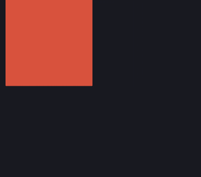

# Exercices Animations

Voici quelques exercices pour un peu manipuler les animations.

## :memo: Objectifs

- Apprendre à manipuler les animations
- Suivre des consignes précises.
- Apprendre à se débrouiller en allant lire la théorie vue ou la documentation.

## :white_check_mark: Evaluations

- Respect des consignes.
- La syntaxe est correcte.
- L'indentation est correcte.

## Le cube qui bouge

- Créer une div de 200px de large et de hauteur.
- Créer une animation (keyframe) avec le nom `move`
- Définir un changement de couleur pour chaque pourcentage suivant: 0%, 25%, 50%, 75%, 100%
- Faire en sorte que le carré se déplace sur la page en suivant un chemin carré (voir exemple).
- Utilisez `animation-iteration-count` pour faire répéter l'animation à l'infini
- Utilisez `animation-direction` pour que l'animation se joue une fois à l'endroit et ensuite dans l'autre sens.

Voici un exemple, vous n'êtes pas obligé d'avoir exactement la même chose pour les couleurs.

## Transition (W3School quiz)

[Les exercices sont par ici](https://www.w3schools.com/css/exercise.asp?filename=exercise_css3_transitions1)

## Animations (W3School quiz)

[Les exercices sont par ici](https://www.w3schools.com/css/exercise.asp?filename=exercise_css3_animations1)

## Feel the Music & Head Hunter

Reprend la maquette Feel the Music et/ou Head Hunter et ajoute des animations. Par exemple fait en sorte que les bulles en arrière-plan de la page principale se déplace constamment sur ta page. Ou bien anime les boutons ou la photo de la femme. Anime tous les éléments à droite sur la page Head Hunter. Bref, c'est le moment d'expérimenter et de t'amuser!

[:rewind: Retour au sommaire du cours](./README.md#table-des-matières)
