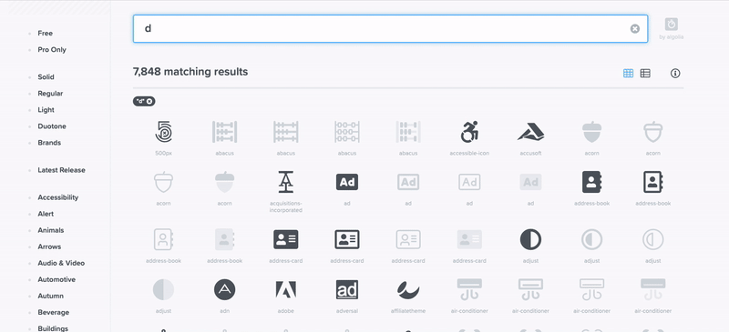

<!-- omit in toc -->
# Font Awesome

Voici un petit tuto sur comment utiliser Font Awesome dans vos projets.

Font Awesome est une police de caractère composé de plus de 19,287 Pro Icons dont **2,016 Free Icons**.

De plus l'intérêt est de pouvoir utiliser vos icônes comme une simple police de caractère, toutes les propriétés applicable à du texte le sont aussi sur vos icônes (color, font-size, animation/transform...)

<!-- omit in toc -->
## Table des matières

- [Mise en place](#mise-en-place)
- [Utilisation](#utilisation)
  - [HTML](#html)
  - [Pseudo-element (avancé :fire:)](#pseudo-element-avancé-fire)
    - [1. Définir le code commun pour toutes les icônes](#1-définir-le-code-commun-pour-toutes-les-icônes)
    - [2. Faire référence au icônes individuelles.](#2-faire-référence-au-icônes-individuelles)

## Mise en place

On va importer notre font dans notre fichier `.css`.

```css
@import url('https://cdnjs.cloudflare.com/ajax/libs/font-awesome/6.2.0/css/all.min.css');
```

On peut vérifier sur [CDNJS](https://cdnjs.com/libraries/font-awesome) si il y a une nouvelle version disponible.

C'est tout ce que l'on a besoin de faire en amont!

[:arrow_up: Revenir au top](#table-des-matières)

## Utilisation

### HTML

Il est possible d'utiliser directement une balise HTML pour afficher son icône. Pour cela, rendez-vous dans [la section Icons du site de Font Awesome](https://fontawesome.com/icons) et choisissez votre icône **gratuite**. Vous pouvez également effectuer une recherche.

Une fois votre icône sélectionné cliquez sur la balise `<i>`. Cela copie la balise complète qui est maintenant prête à être intégrée dans votre fichier HTML.



[:arrow_up: Revenir au top](#table-des-matières)

### Pseudo-element (avancé :fire:)

Une autre méthode est l'utilisation du CSS et des *pseudo-element*. Car peut-être que sur votre projet, changé l'HTML n'est pas possible. Voici la marche à suivre:

#### 1. Définir le code commun pour toutes les icônes

Préparons du code qui servira à toutes nos icônes. Autant le faire directement pour être tranquille.

```css
.icon::before {
    display: inline-block;
    text-rendering: auto;
    -webkit-font-smoothing: antialiased;
  }
```

#### 2. Faire référence au icônes individuelles.

Ici on va réutiliser le même pseudo sélecteur sur notre icône que celui utiliser précédemment, donc **::before**. Dans le content on va mettre le code "unicode" fournit sur la page de l'icône. Et dans la font on va utiliser celle qui correspond au style qu'on a besoin (brand, solid, regular, light ou sharp-solid) que l'on peut également retrouver sur la page de notre icône.

```css
.gaming::before {
  font: var(--fa-font-brands);
  content: "\f392";
}
/* 
  font: var(--fa-font-solid);
  font: var(--fa-font-regular);
  font: var(--fa-font-light);
  font: var(--fa-font-sharp-solid);
*/
```

```html
  <div class="icon gaming"></div>
```

> :bulb: Il y a encore pas mal d'autres configurations possible avec les pseudos-element. Mais nous avons vu ici le nécessaire pour vos sites. Si vous voulez en savoir plus, comme d'habitude, allez lire [:book: la documentation](https://fontawesome.com/docs/web/add-icons/pseudo-elements#css-pseudo-elements-and-duotone)

[:arrow_up: Revenir au top](#table-des-matières)

[:rewind: Retour au sommaire du cours](./README.md#table-des-matières)
