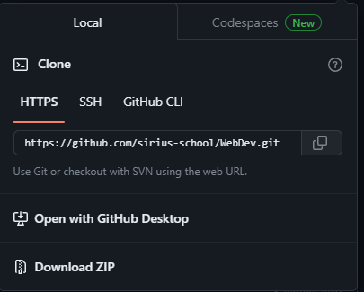
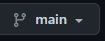
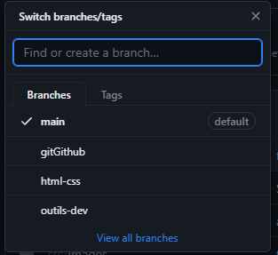
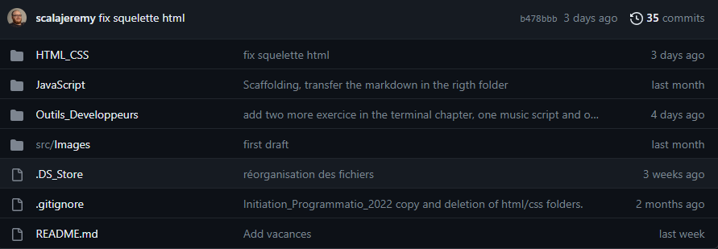

<!-- omit in toc -->
# Git & Github

<!-- omit in toc -->
## Table des matières
- [Introduction](#introduction)
- [Installation](#installation)
- [Les termes](#les-termes)
- [Github.com](#githubcom)
- [Les branches](#les-branches)
- [.gitignore](#gitignore)
- [Les commandes](#les-commandes)
- [Exercice](#exercice)
- [Conclusion](#conclusion)

## Introduction

Git ne vient pas de nulle part, il répond à un besoin des développeurs. Il a été créer dans le but d'archiver en ligne tous les changements que le développeur et ses collaborateurs feront dans le code source du site ou du logiciel. Durant notre formation nous utiliserons assez régulièrement *Git* pour vous apprendre à garder une trace de tout changement dans votre code. Git s'utilise presqu'exclusivement à l'aide de commandes dans le terminal de votre ordinateur. Plus tard dans la formation nous aurons aussi l'occasion d'utiliser *Github Desktop* qui lui possède une interface visuelle.

## Installation

1. Vous devez tout d'abord créer votre compte [Github](https://github.com/) ou lier votre adresse mail. Le site Github est la plateforme qui vous lie au monde du développement web et vous permettra d'accèder à vos projets.
2. Une fois que vous avez créé votre compte Github, vous devez installer Git sur votre ordinateur. Git est un logiciel de contrôle de version qui vous permettra de gérer vos projets et de collaborer avec d'autres développeurs.
3. Rendez-vous sur le [site officiel de Git](https://git-scm.com/downloads) et téléchargez l'installateur Git pour Windows en version ``standalone``.
Une autre façon d'installer Git est de passer par ``winget`` avec la commande `winget install --id Git.Git -e --source winget` (disponible pour des versions récentes de Windows).
4. Exécutez l'installateur téléchargé et suivez les instructions d'installation. Vous pouvez accepter les paramètres par défaut, à moins que vous souhaitiez personnaliser certaines options.
5. Après l'installation, vous pouvez vérifier si Git est correctement installé en ouvrant le terminal PowerShell 7. Tapez la commande ``git --version`` et vous devriez voir la version de Git s'afficher. Si ce n'est pas le cas, il sera peut-être nécessaire de redémarrer votre ordinateur.

## Les termes

Pour qu'il soit plus facile de parcourir ce cours, voici un florilège des termes les plus souvent utilisés et leurs significations :

- **Repository (ou "Repo")** : Un dépôt Git contenant les fichiers de votre projet. Il peut être local (sur votre machine) ou distant (sur Github). Il vous permet de suivre l'historique des modifications, de collaborer avec d'autres personnes et de partager votre code.

- **Clone** : Créer une copie locale d'un référentiel distant. Vous pouvez cloner un référentiel Github sur votre machine pour travailler dessus.

- **Commit** : Une sauvegarde des modifications apportées à votre référentiel Git. Un commit est accompagné d'un message décrivant les changements effectués.

- **Branch** : Une branche est une version alternative de votre référentiel Git. Elle permet de travailler sur des fonctionnalités ou des corrections de bugs isolées sans affecter la branche principale (habituellement appelée ``master`` ou ``main``). **Le nom donné à une branche est super important et doit comporter le nom de la fonctionnalité pour laquelle la branche a été créée.**

- **Pull Request** : Une demande de fusion. Lorsque vous travaillez sur une branche séparée, vous pouvez créer une pull request pour proposer vos modifications à intégrer dans la branche principale du référentiel.

- **Merge** : Fusionner des branches. Lorsque vous fusionnez une branche avec une autre (par exemple, une pull request est acceptée), les modifications de la branche source sont intégrées à la branche cible.

- **Issue** : Une demande de fonctionnalité, un signalement de bogue ou toute autre discussion autour d'un projet. Les issues sont utilisées pour suivre les problèmes et les discussions entre les contributeurs. Issue est aussi utilisé pour simplement dire qu'il y a une erreur.

- **Fetch** : Récupérer les dernières modifications depuis le référentiel distant sans les fusionner immédiatement avec votre branche de travail. La commande `git fetch` permet de récupérer les changements du référentiel distant et de les enregistrer localement.

- **Pull** : Récupérer les dernières modifications d'un référentiel distant. La commande `git pull` est utilisée pour récupérer les changements du référentiel distant et les fusionner avec votre branche locale.

- **Push** : Envoyer vos commits vers un référentiel distant. La commande `git push` est utilisée pour pousser vos modifications locales vers un référentiel distant, tel que Github.

- **Readme** : Un fichier de documentation **important** qui décrit le projet, son fonctionnement et donne des instructions sur la façon de l'utiliser.

Ce ne sont là que quelques-uns des termes couramment utilisés sur Github. Il existe de nombreux autres termes spécifiques à Github que vous pouvez explorer en fonction de vos besoins et de votre utilisation de la plateforme.

## Github.com

Maintenant que vous avez effectué l'installation et que vous connaisez quelques termes Git. Attardons-nous un peu sur l'interface du site github.com et particulièrement sur le dépôt de votre [cours](https://github.com/sirius-school/WebDev).

 
- Ce bouton vous permet d'accèder à la modal suivante : 
 
- Dans cette modal nous retrouvons l'url `.git` qui est nécessaire pour pouvoir **cloner** un repository (qu'il soit à vous ou à quelqu'un d'autre).
- Durant la formation nous n'utiliserons que l'onglet HTTPS car vous êtes la plupart sur des ordinateurs qui changeront de mains à un moment donné. Quoi qu'il en soit sachez qu'il existe les clés SSH et je vous renvoi vers [une autre partie du cours](./ssh_github.md) si cela vous intéresse.
- Plus tard dans la formation nous aurons l'occasion de nous familiariser avec le programme ``Github Desktop`` et donc d'utiliser le bouton `Open with Github Desktop`. 
- Vous avez aussi la possibilité d'enregistrer n'importe quel repository en fichier compressé ``.zip`` attention toutefois que le fichier téléchargé sera indépendant de Github et donc uniquement enregistré localement sur votre machine.

 
- Ce bouton-ci vous permet d'accèder au menu des branches du repository : 
 
- A savoir, la branche `main` ou `master` est la branche créée par défaut. Les 3 autres branches reprise dans l'image ci-dessus descendent directement de la branche `main`. 
 
- Cette partie du site Github.com nous montre le contenu du repository sur la branche `main` mais aussi la dernière modification ayant été faite et par qui (Jeremy dans ce cas-ci). En haut à droite de l'image on retrouve le nombre de commits ayant été faits sur cette branche et nous pouvons accèder à tout l'historique en cliquant dessus.

Une chose très importante lorsque vous travaillez en équipe sur le même projet et donc sur le même repository c'est la ***COMMUNICATION***. Si vous faites une modification sur une branche sur laquelle vous et vos collègues vous travaillez en même temps, il est ***PRIMORDIAL*** de les avertir. Car si de leurs côtés ils n'ont pas `fetch` et `pull` cette nouvelle version et qu'ils effectuent une modification sur une ancienne version, le résultat risque fort d'être un conflit. Ce n'est pas grave en soi et il suffit de suivre les indications données par Github pour s'en sortir mais c'est une perte de temps et parfois de données.

## Les branches
 
- Le principe de branche est fondamentale lorsqu'un projet est géré par plusieurs personnes. L'image ci-dessus nous explique comment cela fonctionne.
    - Un projet démarre toujours par la branche `main` ou `master`.
    - La branche `Bugfix` est créée descendant de la branche `main`.
      - Elle possède deux commits, le commit initial et dans ce cas-ci le commit final.
      - Cette branche est ensuite merge sur la branche `master`.
    - Pendant les étapes de la branche `Bugfix`, la branche `master` a subi une modification et donc un commit.
      - Elle est ensuite fusionnée avec la branche `Bugfix` et donc subi de nouveau une modification et un commit.
    - La branche `Feature` a été créée lors du deuxième commit de la branche `master`.
      - Elle possède, elle aussi, deux commits.
      - Comme la branche `Bugfix` elle est merge sur la branche `master`.
    - La branche `master` possède les deux fonctionnalités venant des branches `Bugfix` et de `Feature`.

## .gitignore

Il y a certains fichiers qu'il ne faut jamais publier sur Github, pour des raisons de sécurité et/ou de confidentialité. Le fichier ``.gitignore`` existe pour exclure de l'envoi les fichiers que vous ne devez pas publier. Je vous recommande fortement de prendre l'habitude de toujours créer ce fichier à **chaque nouveau projet**.

## Les commandes

Voici la liste des principales commandes Git sous Windows :

| Commande | Description |
|---|---|
| `git init` | Initialise un nouveau référentiel Git dans le répertoire actuel. |
| `git clone <url>` | Clone un référentiel distant existant sur votre machine. |
| `git add <fichier>` | Ajoute un fichier spécifique à l'index de Git pour le suivi des modifications. |
| `git add .` | Ajoute tous les fichiers modifiés et nouveaux à l'index de Git. |
| `git commit -m "message"` | Valide les modifications ajoutées à l'index avec un message de commit. |
| `git status` | Affiche l'état des modifications dans votre référentiel Git. |
| `git push` | Envoie les modifications validées vers le référentiel distant. |
| `git pull` | Récupère les dernières modifications depuis le référentiel distant et **les fusionne** avec votre version locale. |
| `git fetch` | Récupère les dernières modifications depuis le référentiel distant **sans les fusionner immédiatement** avec votre branche de travail. |
| `git branch <branche>` | Créer une nouvelle branche dans votre référentiel Git. |
| `git branch` | Affiche la liste des branches dans votre référentiel Git. |
| `git checkout <branche>` | Bascule vers la branche spécifiée. |
| `git merge <branche>` | Fusionne la branche spécifiée avec la branche actuelle. |
| `git log` | Affiche l'historique des commits dans votre référentiel Git. |
| `git diff` | Affiche les différences entre les modifications non validées et la dernière validation. |
| `git remote add <nom> <url>` | Ajoute un référentiel distant avec le nom spécifié et l'URL associée. |
| `git remote -v` | Affiche les référentiels distants configurés pour votre référentiel Git. |

Ce tableau résume les commandes Git les plus couramment utilisées sous Windows. Il existe de nombreuses autres commandes et fonctionnalités disponibles. Vous pouvez toujours consulter la [documentation officielle de Git](https://git-scm.com/docs) pour en savoir plus sur les différentes commandes et leur utilisation spécifique.

## Exercice

Vous avez créer avec Jeremy un fichier `README.md` pour vous apprendre à utiliser le markdown. Je vais vous demander d'enregistrer ce petit projet sur Github. Mais pas avec n'importe quel nom de projet vous devez reprendre votre nom sur Github. Exemple : si votre nom sur Github est JeanPierre alors vous devrez enregistrer votre fichier sous le nom JeanPierre en respectant bien la casse 😜

## Conclusion

Git et Github sont des outils indispensables pour un développeur et pour travailler en équipe. Il y a beaucoup d'avantage quand on l'utilise bien et nous aurons tout le temps de la formation pour se familiariser avec ce formidable outil. 

**Fini les clés USB, Github est là !**

[:arrow_up: Revenir au top](#table-des-matières)

[:arrow_right: Suite du cours : *Exercice de logique*](../../Python/exercice_logique.md)

[:rewind: Retour au sommaire du cours](../../README.md)

> Cours original : [Lucas Ielli](https://github.com/LucasIelli)