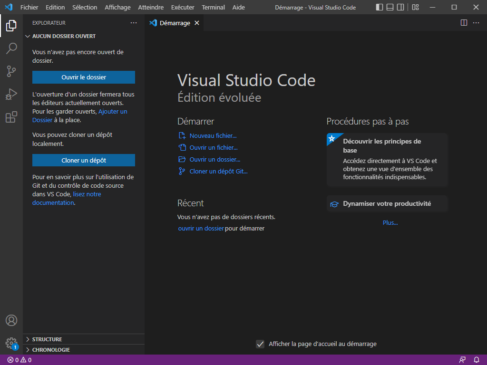
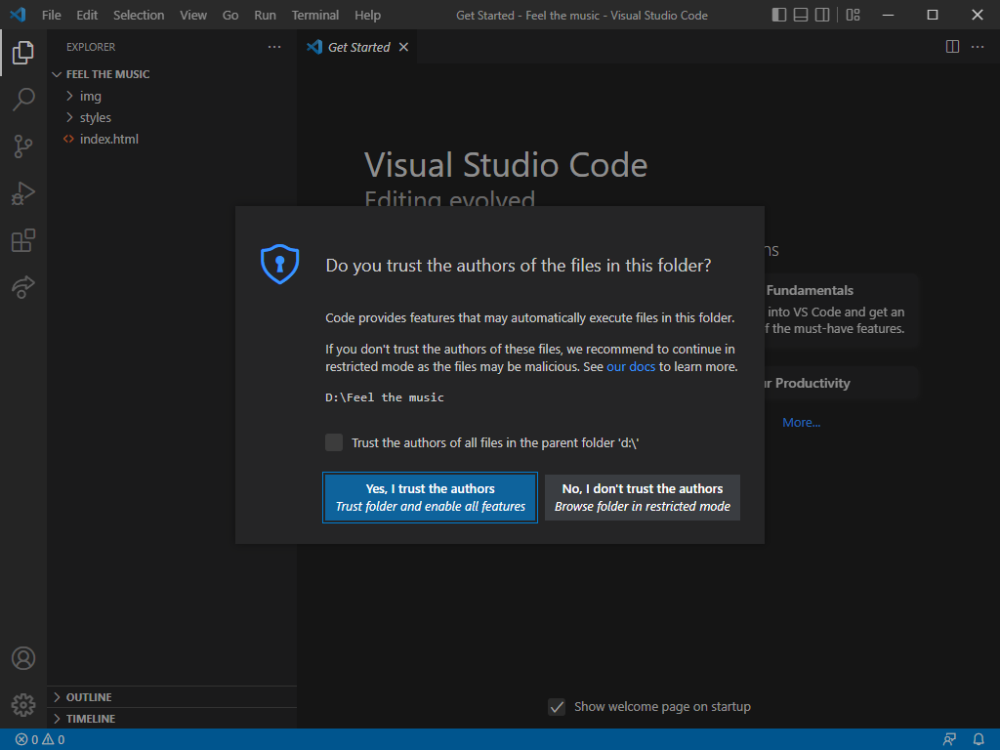
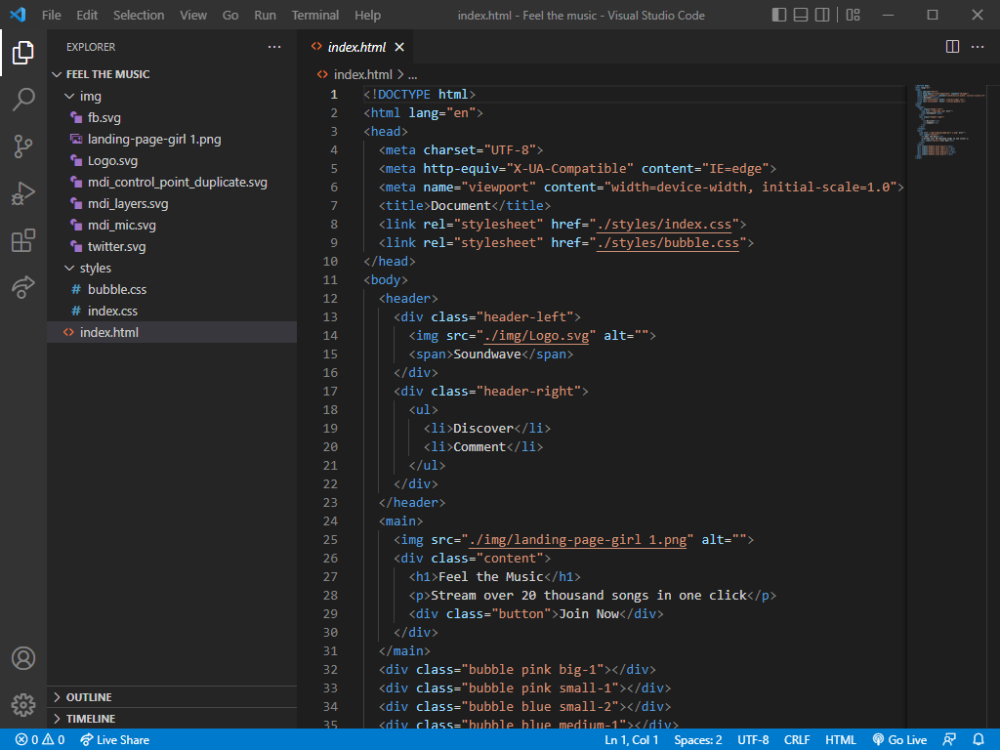
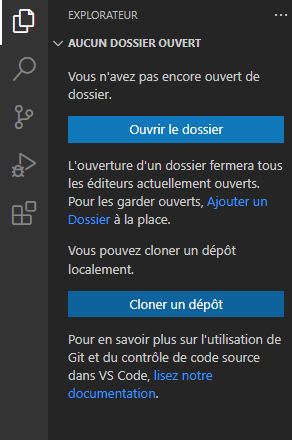
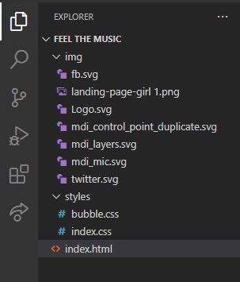
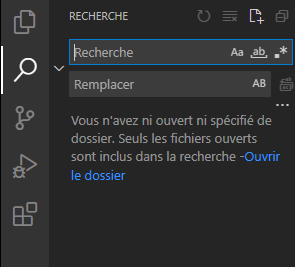
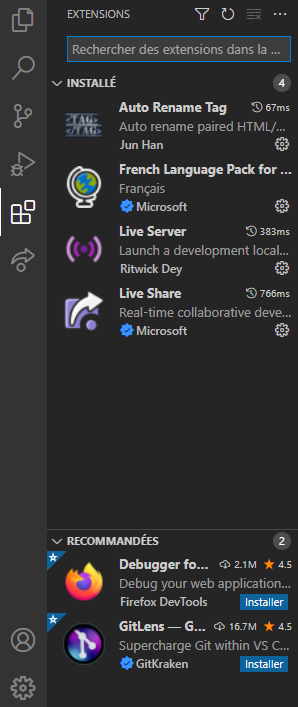
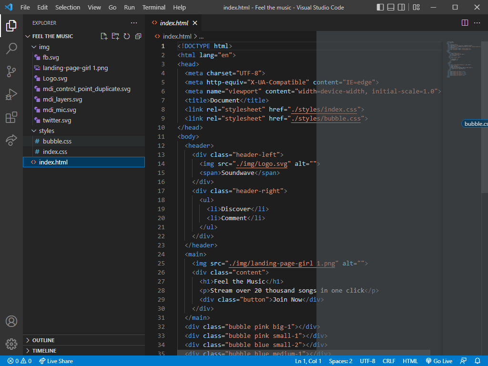
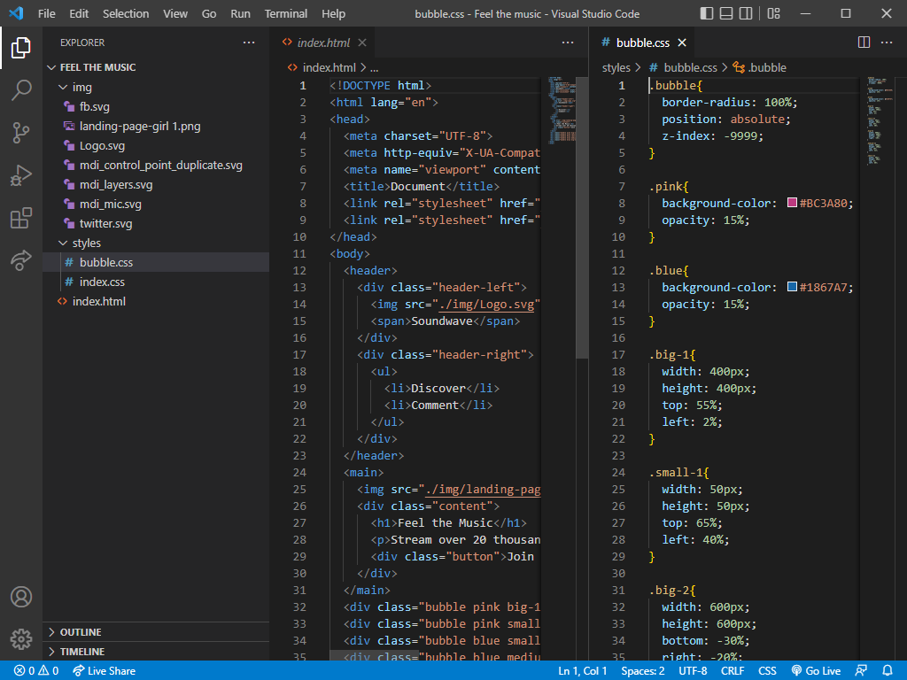
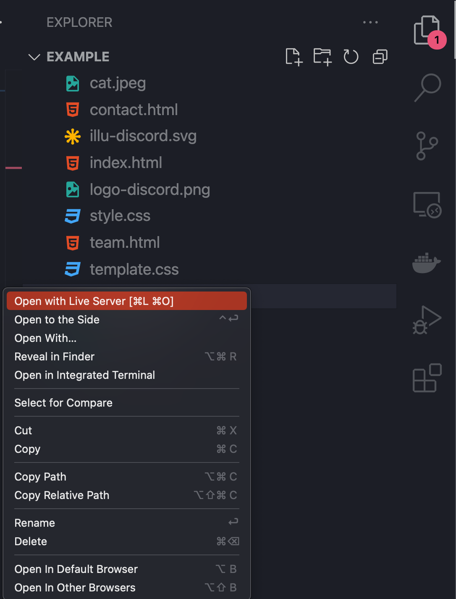

<!-- omit in toc -->
# VSCode, mon amour <3

Pendant cette formation nous utiliserons VSCode comme éditeur de code! Il en existe d'autre évidement (SublimeText, ATOM, Brackets,...) mais histoire de tous commencé sur la même base, VSCode s'est avéré être le choix le plus judicieux. Si par après, lors de ta carrière professionnel, tu décides de changer pour un autre logiciel aucun soucis. Au final c'est juste un éditeur de "texte".

VSCode est un outil merveilleux avec pleins de fonctionnalités, même trop par rapport à ce que l'on a besoin, nous, pour cette formation. Sa première ouverture peut faire peur, mais ne te tracasse pas je vais t'aider à prendre tes marques sur ce logiciel.

<!-- omit in toc -->
## Table des matières

- [L'interface](#linterface)
  - [Écran d’accueil](#écran-daccueil)
  - [Dossier de confiance](#dossier-de-confiance)
  - [Dossier ouvert](#dossier-ouvert)
  - [Menu de gauche](#menu-de-gauche)
  - [Split view](#split-view)
- [Tips dans l'éditeur](#tips-dans-léditeur)
  - [Quelques paramètres intéressants](#quelques-paramètres-intéressants)
    - [Word wrap](#word-wrap)
    - [Format on save et default formatter](#format-on-save-et-default-formatter)
- [Extensions](#extensions)
  - [Live Server](#live-server)
  - [Auto Rename Tag](#auto-rename-tag)
  - [Bearded Icons \& Theme](#bearded-icons--theme)
  - [Le reste ?](#le-reste-)
- [Raccourcis](#raccourcis)
  - [Les flèches](#les-flèches)
  - [`Alt` + flèches haut et bas](#alt--flèches-haut-et-bas)
  - [`Alt` + `Shift` + flèches haut et bas](#alt--shift--flèches-haut-et-bas)
  - [`Ctrl` + `Shift` + P](#ctrl--shift--p)
  - [`Alt` + curseur](#alt--curseur)
  - [`ctrl` + `retour arrière`](#ctrl--retour-arrière)
  - [`shift` + `suppr`](#shift--suppr)
  - [`Ctrl` + `f`](#ctrl--f)
  - [`Ctrl` + `Enter`](#ctrl--enter)
  - [`Alt` + `Z`](#alt--z)
- [Emmet](#emmet)
  - [Structure HTML](#structure-html)
  - [Lorem Ipsum](#lorem-ipsum)
  - [Les listes et descendance](#les-listes-et-descendance)
  - [Contenu, Class et ID, multiplicateur, Attribut](#contenu-class-et-id-multiplicateur-attribut)
  - [Le CSS avec Emmet](#le-css-avec-emmet)
  - [Cheatsheet](#cheatsheet)

## L'interface

### Écran d’accueil

À l'ouverture, pour la première fois, VSCode affiche un écran de démarrage qui vous propose de le configurer. Vous pouvez éventuellement sélectionné votre thème. Ce qui nous intéresse ici c'est la création d'un nouveau fichier ou l'ouverture d'un dossier.

Pour tous les exercices il va falloir travailler dans un dossier, du coup cliquons sur "Nouveau dossier..."

### Dossier de confiance

Quand vous ouvrez un dossier pour la première fois il est possible que VSCode vous demande si vous pouvez avoir confiance envers les auteurs de ce dossier et de ses fichiers. Évidement, dans notre cas, on peut se faire confiance. Cet avertissement est là pour vous prévenir que si vous avez téléchargé du code en ligne et que vous n'êtes pas sûr de la source, il vaudrait mieux ne pas l'exécuter. Il est possible que du code se lance automatiquement et compromette votre ordinateur. Méfiance donc...

### Dossier ouvert

Une fois un dossier ouvert on se retrouve avec l'arborescence de notre dossier sur le côté gauche de la fenêtre de VSCode. De là on peut ouvrir tous les fichiers "texte" que l'on souhaite. Que ce soit de l'HTML, du CSS, du JavaScript ou tout autre langage de programmation. VSCode est aussi capable de vous afficher des images dans la plupart des formats courant (jpg, png,...).

> :white_check_mark: Essayez au plus possible d'avoir un organisation claire de vos dossiers de travail. Par exemple:

<pre>
Nom-de-projet
  |__ img
  |   |__ fb.png
  |   |__ logo.png
  |__ css
  |   |__ global.css
  |   |__ style.css
  |__ js
  |   |__ script.js
  |__ pages
  |   |__ contact.html
  |   |__ footer.html
  |   |__ header.html
  |__ index.html
</pre>

### Menu de gauche

Vous pouvez retrouver sur le côté gauche un menu qui contient plusieurs panneaux.

- Le premier est la gestion de vos dossiers et fichiers. Vous serez amené à utiliser ce panneau constamment pour passer d'un fichier à un autre.

- Le deuxième est l'outil de recherche global. Il permet de chercher dans tous les fichiers de votre dossier actif. Il est également possible de remplacer toutes les occurrences d'un mot dans vos fichiers. Très pratique!

- Le cinquième est le panneau qui permet de gérer les extensions installées et d'en trouver des autres. Voyons ça un peu plus loin.

Les autres menus servent notamment à gérer le `versioning` de votre projet ou de lancer des tests pour debugger votre code. Mais nous ne les utiliserons pas.

### Split view

Une fonctionnalité fort appréciable sur VScode surtout lorsque vous n'avez qu'un écran, c'est la possibilité de `split`/séparer les différentes vues. Pour ce faire il suffit d'avoir plusieurs onglets de fichiers ouvert. Ensuite cliquer et glisser un onglet dans un des coins/bords de la fenêtre de VScode pour voir apparaître en transparence l'espace que va prendre le nouvel onglet.

## Tips dans l'éditeur

Voici quelques astuces quand tu utilises VSCode. Pour le moment, comme c'est le début ça ne te dit pas encore grand chose. Mais n'hésite pas à revenir les lires quand tu auras commencés tes premières pages.

- Comme dans n'importe quel éditeur de texte, si y a du code souligné, c'est que c'est pas bon! Fait bien attention à ce que VSCode t'indique. Si tu vois un soulignement en vague en dessous d'une de tes balises, c'est probablement qu'il y a un soucis. Relis le code qui précède et regarde si il n'y a pas un soucis de balise non-fermée, un point-virgule manquant ou une faute de frappe.
- Les couleurs sont importantes! Quand tu écris du code les **balises** sont dans une couleur, les **attributs** ont une couleur différente, les **valeurs** ont une autre couleur. Si tu écris un élément de code et qu'il ne prend pas la même couleur, c'est probablement que VSCode ne comprend pas ton code correctement. Relis le code qui précède et regarde si il n'y a pas un soucis de balise non-fermée, un point-virgule manquant ou une faute de frappe.
- Quand tu sélectionnes une balise, sa jumelle est sélectionnée également. Cela te permet de savoir si elle est bien fermée ou non.
- L'indentation automatique te permet également de savoir si tu es dans la bonne balise ou non. Si lorsque tu va à la ligne l'indentation ne te semble pas correcte, c'est probablement que ton code est mal interprété et qu'il y a un soucis quelque part. Jette un coup d'oeil aux balises précédentes pour voir ce qu'il se passe.

### Quelques paramètres intéressants

Vous pouvez rechercher ces paramètres dans les "Settings (UI)" de VSCode en cliquant sur le petit engrenage en bas à gauche ou en ouvrant le menu avec la palette (ctrl+p)

#### Word wrap

Vous pouvez activer cette fonctionnalité si vous voulez que le texte passe à la ligne visuellement quand il arrive en bout de fenêtre. Cela ne crée pas une nouvelle ligne. C'est bien pratique quand vous avez beaucoup de texte. Vous pouvez aussi utiliser le raccourcis `alt+Z` pour l'activer ou le désactiver sur le document en cours.

#### Format on save et default formatter

Cette option va vous permettre d'activer un formateur de code quand vous sauvegarder vos fichiers. Cela peut vous aider à respecter l'indentation de votre code si vous êtes un peu maladroit. Il est également possible de choisir quel formateur vous voulez du style Prettier ou autre. Attention que ça ne corrige pas le code pour vous, ça ne fait que l'ajuster visuellement.

## Extensions

Vous pouvez personnaliser votre expérience avec VSCode au fur et à mesure de votre apprentissage et de votre carrière grâce aux extensions. Ces petits bout de code qui vont venir vous filer un coup de main pour écrire votre code ou modifier le comportement de VSCode.

### Live Server

Live Server permet de simuler un serveur sur votre machine pour voir comment se comporte votre site. Alors dans cette section on ne va pas l'utiliser pleinement. Cependant il a une utilité très intéressant, c'est la prévisualisation et le "refresh live". C'est à dire qu'à chaque fois que vous enregistrez votre page, votre aperçu se met à jour sans que vous deviez rafraîchir votre page.

Pour utiliser Live Server, il suffit d'ouvrir non pas un fichier avec VSCode, mais un dossier. Vous retrouverez dans la barre latéral l'onglet avec vos fichiers, si vous cliquez droit dessus vous aurez l'option `Open with Live Server`

[:floppy_disk: Installer Live Server](https://marketplace.visualstudio.com/items?itemName=ritwickdey.LiveServer)

### Auto Rename Tag

Une petite extension qui va vous faciliter la vie. Celle-ci va, comme son nom l'indique, renommer la balise correspondante à celle que vous venez de modifier. Pratique!

[:floppy_disk: Installer Auto Rename Tag](https://marketplace.visualstudio.com/items?itemName=formulahendry.auto-rename-tag)

### Bearded Icons & Theme

Une petite extension visuelle pour changer les icônes et l'apparence de vos fichiers et dossier dans l'explorateur de fichiers ainsi que le style complet de l'éditeur.

[:floppy_disk: Installer Bearded Icons](https://marketplace.visualstudio.com/items?itemName=BeardedBear.beardedicons)

[:floppy_disk: Installer Bearded Theme](https://marketplace.visualstudio.com/items?itemName=BeardedBear.beardedtheme)

### Le reste ?  

Il y a évidement des centaines, des milliers d'extensions. Vous pouvez par exemple installer des extensions qui gère la mise en forme du code (Prettier) ou des aides pour écrire votre code JavaScript, Python, C++,...

> :exclamation: Ne pas installer **trop** d'extensions au risque parfois d'avoir des incompatibilités. N'installer que ce dont vous avez besoin et surppimer le surplus.

[:arrow_up: Revenir au top](#table-des-matières)

## Raccourcis

Voici quelques raccourcis VSCode, ceux-ci peuvent varier d'un système d'opération à l'autre, ici Windows.

Voici [un lien vers tous les raccourcis pour Windows](https://code.visualstudio.com/shortcuts/keyboard-shortcuts-windows.pdf) :window:

Voici [un lien vers tous les raccourcis pour Mac](https://code.visualstudio.com/shortcuts/keyboard-shortcuts-macos.pdf) :apple:

Pas besoin de les retenir tous, juste ceux que vous trouver utiles pour votre utilisation de VSCode, les autres viendront quand vous en aurez besoin.

### Les flèches

Ce n'est pas un raccourcis lié à VSCode, mais il est très important d'apprendre à naviguer dans son code à l'aide des flèches. Normalement on garde ses deux mains sur le clavier et ainsi on a plus facile à rectifier du code en utilisant les flèches.

### `Alt` + flèches haut et bas

L'utilisation de `alt` est super importante quand vous coder dans VSCode. Le fait de maintenir `alt` et d'ensuite utiliser les flèches haut et bas de votre clavier permet de déplacer une ligne de code. Bien plus pratique que d'utiliser un copier/coller.

### `Alt` + `Shift` + flèches haut et bas

Ce raccourci permet de dupliquer la ligne sur laquelle se trouve votre curseur actuellement ou la sélection.

### `Ctrl` + `Shift` + P

Ce raccourci permet de faire apparaître la palette de VSCode. Dedans vous pouvez y retrouver différents raccourcis comme celui des préférences ou de vos extensions. Cela est possible tant que `>`se situe devant votre recherche, mais si vous l'effacez vous pouvez aussi rechercher des fichiers!

### `Alt` + curseur

Ce raccourci permet de placer de multiple curseur dans votre document.

### `ctrl` + `retour arrière`

Ce raccourci permet de supprimer mot par mot.

### `shift` + `suppr`

Ce raccourci permet de supprimer toute la ligne où est votre curseur.

### `Ctrl` + `f`

Ce raccourci permet d'afficher la recherche dans le document en cours.

### `Ctrl` + `Enter`

Ce raccourci permet d'allez directement à la ligne suivante sans embarquer le reste de la ligne actuelle. On peut aussi allez à la ligne précédente en appuyant sur  `Ctrl + Shift + Enter`

### `Alt` + `Z`

Active ou désactive le [word wrap](VSCode.md####Word-wrap)

[:arrow_up: Revenir au top](#table-des-matières)

## Emmet

Il s'agit d'un petit plugin directement intégré à VSCode qui permet de taper du code HTML et CSS beaucoup plus rapidement. Alors, ça demande un petit temps d'apprentissage aussi pour l'utiliser, mais ça simplifie grandement la vie sur le long terme.

Pour pouvoir l'utiliser correctement il faut bien être dans un document HTML ou CSS. Donc pense bien à enregistrer ton fichier dans le bon format.

Ensuite dès qu'on rentre le nom d'une balise on a déjà Emmet qui te propose de créer les deux balises directement, plus besoin de le faire toi même. Il suffit d'appuyer sur `enter`.

Voici quelques exemples:

### Structure HTML

En écrivant juste `!` et en validant avec `enter` tu peux directement créer ton squelette HTML de base.

### Lorem Ipsum

Le lorem ipsum est un texte fictif en latin qui est devenu la référence du texte de substitution. C'est à dire un texte que l'on utilise pour remplir nos `
`et `
`dans le but de pouvoir commencer rapidement à styliser notre page, sans devoir attendre le contenu complet fournit par le client.

Pour l'utiliser il suffit d'écrire `lorem`et de valider avec `enter`. Cela va créer un paragraphe de Lorem Ipsum. Si tu veux plusieurs paragraphes tu peux utiliser ajoute un multiplicateur à la suite de  `lorem` comme par exemple `lorem*2`ce qui du coup te créera 2 paragraphe. On peut aussi décider du nombre de mots dont on a besoin, il suffit d'ajouter un chiffre à la fin de `lorem`, comme par exemple `lorem10` pour obtenir 10 mots. 

### Les listes et descendance

Il est également possible de créer des listes plus rapidement, pour ce faire tu n'a qu'a écrire le type de liste que tu veux (`ul`ou `ol`).

Mais ça va plus loin que ça, il y a moyen de directement écrire le nombre de `li` dont tu as besoin dans ta liste: `ul>li*5`. Ceci va créer une liste avec 5 `<li>`. C'est à ça que sert `>`,c'est pour indiquer la descendance.

Et on peut encore pousser le vice plus loin en demandant directement de nous créer une liste et son contenu: `ul>li{lien $}*5`. Ce qui est entre accolades ici c'est le contenu de ma balise `<li>`.

### Contenu, Class et ID, multiplicateur, Attribut

Comme vu plus haut il y a donc moyen de préciser à Emmet le contenu de notre balise en utilisant les `{}`. Il est également possible de lui demander de compter pour nous le nombre d'élément qu'il crée en utilisant `$`, cela va ajouter un chiffre pour chaque fois qu'il doit répéter l'opération avec `*x`

C'est possible de donner la valeur d'un attribut également en utilisant `[]`. Il suffit d'écrire le nom de l'attribut de notre balise comme dans cet exemple: `a[href="#"]`

Il est également possible de préciser la classe ou l'id de notre élément directement: `div.ma-classe` ou `div#monID`

Du coup on peut combiner le tout: `(div.ma-classe#monID$>p>lorem)*5`. Ici ce qui est en parenthèse va être répéter 5 fois. On a un div avec une classe, un id unique et une balise `
` à l'intérieur contenant chacun un paragraphe de Lorem, le tout qui se répète 5 fois. Très pratique!

### Le CSS avec Emmet

Dès que vous écrivez une propriété en CSS, Emmet se charge ce compléter si besoin. Mais il y a également d'autres petites choses bien pratique comme par exemple les propriétés raccourcies.

Si je tape `m10` comme propriété, Emmet va m'ajouter `margin:10px;`. De nouveau, c'est un gain de temps. On peut allez plus loin en demandant par exemple `mr5`, ce qui donnera `margin-right:5px`.

Il y a tout un tas de propriétés raccourcies, à vous de le trouver à force d'en utiliser. Vous verrez aussi que ces propriétés raccourcies ressemblent à celle qu'on peut retrouver dans des outils comme Tailwind ou Bootstrap.

Il y a d'autres astuces comme par exemple les couleurs. Si on rentre `#1` cela va directement compléter par `#111111`.

### Cheatsheet

Bref, vous l'aurez compris, Emmet c'est top quand on apprend à l'utiliser. Alors c'est à vous de faire la démarche, ici je n'ai montré que quelques exemples, mais il y a encore tellement plus. C'est à force de faire de l'HTML en boucle que vous allez avoir envie d'allez plus vite.

Voici [un lien vers une cheatsheet](https://docs.emmet.io/cheat-sheet/) et un autre vers [la documentation](https://docs.emmet.io/)

[:arrow_up: Revenir au top](#table-des-matières)

[:rewind: Retour au sommaire du cours](./README.md#table-des-matières)
