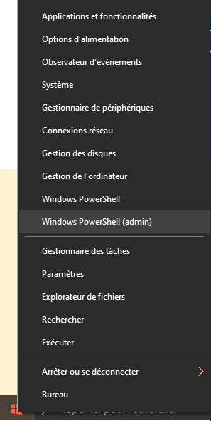
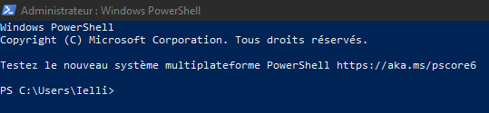

<!-- omit in toc -->
# Le Terminal

<!-- omit in toc -->
## Tables des matières
- [A quoi cela sert ?](#a-quoi-cela-sert-)
- [Installation](#installation)
- [Les commandes](#les-commandes)
- [Exercices](#exercices)


# A quoi cela sert ?

Aujourd'hui Windows est pourvu d'une interface graphique qui est facile et intuitive mais ça n'a pas toujours été le cas. Pour les moins jeunes, vous vous souviendrez peut-être de l'image ci-dessous. Oui, au début les ordinateurs avait une interface qui n'était composé que de lignes de texte parfois incompréhensible. C'était la seule manière d'afficher ce qui était contenu dans un ordinateur, évidemment le contenu n'était autre que des données, des fichiers et des dossiers. Aujourd'hui le terminal est indispensable pour les utilisateurs de Linux mais Windows aurait pu s'en passer **cependant** les informaticiens et nous les développeurs avons toujours besoin de certaines fonctionnalités que nous aurons l'occasion d'aborder dans peu de temps. Fun fact : parmi les développeurs aguéris (surtout sur Linux) l'utilisation de la souris est quasiment proscrite et donc le terminal devient la seule manière de naviguer et de manipuler les données.


# Installation

Dans un premier temps nous allons vérifier que vos ordinateurs possèdent bien la bonne version du terminal Windows PowerShell, en effet si votre ordinateur est sur Windows 10 vous risquez d'avoir les yeux qui piquent un peu.

Pour ouvrir votre terminal vous avez deux options :
- Via votre barre de recherche en tapant ``Windows Powershell``<br>
 
- Via le menu démarrer en cliquant droit ou en utilisant le raccourci ``Win+X`` (en admin = moins de problèmes)<br>


Si vous êtes sur Windows 10 il y a de grandes chances que vous tombiez sur ceci :<br>

> Je vous avais dit que ça piquerait 😂

En réalité c'est simplement que Windows 10 n'embarque pas la nouvelle version du PowerShell. Nous allons donc remedier à cela :

1. [Ce lien vers la documentation Microsoft](https://learn.microsoft.com/fr-fr/powershell/scripting/whats-new/migrating-from-windows-powershell-51-to-powershell-7?view=powershell-7.3) nous explique comment migrer de la version Windows Powershell 5.1 vers la 7.x. Nous y trouvons une information **importante** : ``PowerShell 7 fonctionne côte à côte avec Windows PowerShell``. En d'autres termes le terminal présent sur votre machine Windows 10 gardera de toute façon la version 5.1 du PowerShell et la nouvelle version aussi.

2. [Ce lien d'installation](https://learn.microsoft.com/fr-fr/powershell/scripting/install/installing-powershell-on-windows?view=powershell-7.3#winget) nous donne deux commandes : 
   - ``winget search Microsoft.PowerShell`` qui vérifie quelle est la version en cours.
   - ``winget install --id Microsoft.Powershell --source winget`` qui installera la version 7.x.

3. Si votre version de Windows ne possède pas l'installeur de package `winget` il faudra alors télécharger le fichier ``.zip`` et du coup extraire les dossiers via ``WinRar`` ou ``7zip``. Dans le dossier extrait chercher après le fichier ``pwsh.exe`` et ouvrez-le, ensuite suivez simplement les instructions.

Maintenant que l'installation est finie vous devriez obtenir ceci :<br>

> C'est quand même un peu mieux 😜

# Les commandes

Étant donné que nous allons utiliser le terminal pour la gestion de fichiers, nous verrons uniquement les commandes associées :<br>

> ***Astuce : faire ``tab`` dans le terminal vous permet d'avoir l'auto-complétion !***<br>

| Commande | Description | 
| :---: | :---- |
| gci, dir, ls | Liste les fichiers/dossiers du répertoire. Exemple : ``ls`` ou ``ls .\Sirius\`` | 
| gc, type, cat | Obtenir le contenu d'un **fichier**. Exemple : ``cat .\fichier.txt``  |
| help, man | Aide. |
| cls, clear | Efface l'écran. |
| cpi, copy, cp | Copier un ou plusieurs fichiers/l'arborescence complète. Exemple : ``cp D:\Sirius\WebDev\fichier.txt C:\Autres`` |
| mi, move, mv | Déplacer un fichier/répertoire. Exemple : ``mv .\fichier.txt .\Sirius\`` |
| del, rmdir, rd, rm | Suppression de fichier/répertoire. Exemple : ``rm .\fichier.txt``|
| start | Ouvrir un fichier dans un autre programme. Pas obligatoire vous pouvez simplement mettre le nom du fichier. |
| md, mkdir | Créer un dossier. Exemple : ``md D:\Sirius\WebDev\Nouveau`` en spécifiant le chemin, ``md Nouveau`` si vous ne spécifiez pas de chemin le dossier sera créé dans le répertoire actuel. |
| ni, New-Item | Créer un nouveau fichier, il faut spécifier son extension. Exemple : ``ni fichier.txt``. Attention uniquement sur PowerShell. |
| ren, mv | Renommer un fichier/répertoire. Exemple : ``mv .\fichier.txt nouveauFichier.txt`` si vous êtes dans le bon répertoire sinon vous devez spécifier vous-même le chemin |
| cd, chdir | **L'une des commandes les plus importante**. Changer de répertoire courant. Exemple : ``cd .\Sirius``, ``cd .\Sirius\Autres\``, ``cd..`` ce dernier vous permettra de revenir en arrière un fois. ``cd ..\..`` celui-ci vous fera revenir en arrière deux fois. |
| echo, write | Afficher des chaînes, variables etc sur la sortie standard. Permet aussi d'écrire dans les fichiers. Exemple : ``echo "Bonjour"``, ``echo "Bonjour" > .\fichier.txt`` |
| gps, ps | Liste de tous les processus en cours d'éxectution. |
| spps, kill | Arrêter un processus en cours d'exécution. |
| Ctrl + C | Arrêter un processus au sein du terminal. |
| sls, findstr | Recherche d'une chaine de caractère. |
| iwr, wget, curl | Obtenir le contenu d'une page web. |
| code | Ouvrir VSCode. Exemple : ``code .``, ``code .\Sirius\`` |


[Ressources Wikipedia](https://fr.wikipedia.org/wiki/Windows_PowerShell#Comparaison_du_langage_PowerShell_et_des_langages_de_script_UNIX)

# Exercices

Après l'apprentissage des quelques commandes ci-dessus vous pouvez enfin un peu pratiquer et essayer de résoudre cet exercice :

> N'utilisez pas la commande ``clear`` que je puisse voir les commandes que vous avez utilisées.

- Dans l'interface graphique Windows rendez-vous dans le dossier **``Sirius``** et créez un **dossier ``WebDev``**.
- Dans ce nouveau dossier vous allez créer via le terminal un **fichier ``test.txt``**.
- Trouvez ce fichier dans le terminal et **afficher ``test.txt``**.
- Dans le fichier ``test.txt`` écrivez **(via une commande !)** votre nom et prénom suivi de "Je participe à Sirius 2023 !".
- Copiez ce fichier dans votre dossier Sirius, attention **copier pas déplacer** vous devez avoir ``test.txt`` dans le dossier WebDev **et** Sirius.
- Revenez dans votre dossier Sirius et lister les fichiers/dossiers présents.
- Affichez le contenu du fichier ``test.txt``.
- Supprimez le fichier ``test.txt`` se trouvant dans votre dossier ``WebDev``.
- Toujours via le terminal ouvrez le fichier ``test.txt``.


Un seul me semblait trop peu, je me suis permis d'en ajouter un autre un peu plus poussé, amusez-vous bien 😁 :

> Comme pour le premier n'utilisez pas la commande `clear` afin que je puisse voir les commandes que vous avez utilisées.

- Dans le dossier `Sirius`, créez un nouveau dossier appelé `Scripts`.
- À l'intérieur du dossier `Scripts`, créez un fichier PowerShell nommé `script.ps1`.
   > Pssst, si tu sais ne pas ce qu'est un fichier 'ps1' utilise Google 😊
- Utilisez la commande PowerShell pour afficher le contenu du dossier `Scripts` et vérifiez que le fichier `script.ps1` est présent.
- Ouvrez le fichier `script.ps1` dans un éditeur de texte et ajoutez-y le code suivant :

```powershell
Write-Host "Hello, World !"
```
   > N'oublie pas de sauvegarder -> ``Ctrl + S`` :wink:

- Retourne dans ton terminal et utilise une commande (ou pas ❓) PowerShell pour exécutez le script `script.ps1` et vérifiez que le message "Hello, World !" est affiché dans le terminal.
- Renommez le fichier `script.ps1` en `my_script.ps1`.
- Utilisez la commande PowerShell pour copier le fichier `my_script.ps1` dans le dossier `WebDev` qui se trouve dans le dossier `Sirius`.
- Vérifiez que le fichier `my_script.ps1` est bien présent dans le dossier `WebDev` en utilisant la commande PowerShell pour **afficher** (pas lancer le script) le contenu du fichier `my_script.ps1`.
- Tu n'auras plus besoin de ce fichier tu peux donc le supprimer à l'aide d'une commande PowerShell.

Petit quiz musical 🎵 une façon détournée de vous montrer l'étendue des pouvoirs du terminal, enjoy 😜 :

> Comme pour le premier et le deuxième n'utilisez pas la commande `clear` afin que je puisse voir les commandes que vous avez utilisées.

- Dans le dossier `Sirius`, retournez dans le dossier `Scripts` précédemment créé.
- À l'intérieur du dossier `Scripts`, créez un fichier PowerShell nommé `firstSound.ps1`.
- Ouvrez le fichier `firstSound.ps1` dans un éditeur de texte et ajoutez-y le code suivant :

```powershell
[console]::beep(440,500)
[console]::beep(440,500)
[console]::beep(440,500)
[console]::beep(349,350)
[console]::beep(523,150)
[console]::beep(440,500)
[console]::beep(349,350)
[console]::beep(523,150)
[console]::beep(440,1000)
[console]::beep(659,500)
[console]::beep(659,500)
[console]::beep(659,500)
[console]::beep(698,350)
[console]::beep(523,150)
[console]::beep(415,500)
[console]::beep(349,350)
[console]::beep(523,150)
[console]::beep(440,1000)
```
   > N'oublie pas de sauvegarder -> ``Ctrl + S`` :wink:

- Retourne dans ton terminal et utilise une commande (ou pas ❓) PowerShell pour exécutez le script `firstSound.ps1`.
- Si tu as reconnu la musique qui vient d'être jouée, note-le quelque part :grin:

- Toujours dans le dossier `Scripts`, créez un fichier PowerShell nommé `secondSound.ps1`.
- Ouvrez le fichier `secondSound.ps1` dans un éditeur de texte et ajoutez-y le code suivant :

```powershell
[console]::beep(784,150)
Start-Sleep -m 300
[console]::beep(784,150)
Start-Sleep -m 300
[console]::beep(932,150)
Start-Sleep -m 150
[console]::beep(1047,150)
Start-Sleep -m 150
[console]::beep(784,150)
Start-Sleep -m 300
[console]::beep(784,150)
Start-Sleep -m 300
[console]::beep(699,150)
Start-Sleep -m 150
[console]::beep(740,150)
Start-Sleep -m 150
[console]::beep(784,150)
Start-Sleep -m 300
[console]::beep(784,150)
Start-Sleep -m 300
[console]::beep(932,150)
Start-Sleep -m 150
[console]::beep(1047,150)
Start-Sleep -m 150
[console]::beep(784,150)
Start-Sleep -m 300
[console]::beep(784,150)
Start-Sleep -m 300
[console]::beep(699,150)
Start-Sleep -m 150
[console]::beep(740,150)
Start-Sleep -m 150
[console]::beep(932,150)
[console]::beep(784,150)
[console]::beep(587,1200)
Start-Sleep -m 75
[console]::beep(932,150)
[console]::beep(784,150)
[console]::beep(554,1200)
Start-Sleep -m 75
[console]::beep(932,150)
[console]::beep(784,150)
[console]::beep(523,1200)
Start-Sleep -m 150
[console]::beep(466,150)
[console]::beep(523,150)
```
   > N'oublie pas de sauvegarder -> ``Ctrl + S`` :wink:

- Comme pour le premier son utilise une commande (ou pas ❓) PowerShell pour exécutez le script `secondSound.ps1`.
- Si tu as reconnu la musique qui vient d'être jouée, note-le quelque part :grin:
- Tu n'auras plus besoin des fichiers que tu viens de créer, tu peux donc les supprimer grâce à une commande PowerShell.

Après cette interlude musical on peut aller encore plus loin, en demandant à PowerShell de parler, oui oui de parler :
- Entrez la commande ci-dessous directement dans votre terminal :
```powershell
Add-Type -AssemblyName System.speech
$speak = New-Object System.Speech.Synthesis.SpeechSynthesizer
```
- La commande que vous venez d'intégrer va faire exploser votre ordinateur dans 10 secondes... Je plaisante, cette commande vient seulement d'installer un synthétiseur de voix 😊
- Pour faire parler votre terminal, il suffit de mettre cette commande :
```powershell
$speak.Speak("Salut je suis un robot et tu viens de me permettre de prendre le contrôle de ton ordinateur mouHAHAHAHA")
```
> Psssst, si tu veux pas qu'elle prenne le contrôle de ton ordi, change la phrase 😜

J'espère que ces petits exercices vous ont permis de comprendre un peu comment fonctionne le terminal et que les derniers vous ont au moins un peu amusés. Et au fait, **well done** tout le monde vous maîtrisez les bases du terminal 🎉

[:arrow_up: Revenir au début](#table-des-matières)

[:arrow_right: Suite du cours : *Git & Github*](../Outils_Developpeurs/Github/git_github.md)

[:rewind: Retour au sommaire du cours](../README.md)

> Cours original : [Lucas Ielli](https://github.com/lucasielli)